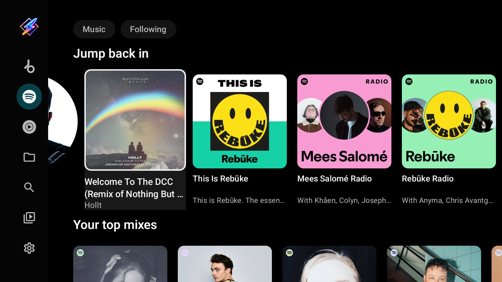

**An Android TV music player for local files, network shares and streaming services, with MilkDrop visuals.**

---

Milkbeat plays music from your TV's storage, USB drives and network folders (SMB, WebDAV, SFTP
and NFS) without plugins.
Add optional metadata, audio and video plugins to browse streaming catalogs, match tracks across
services and play music videos. Everything is built for the TV remote.

- **Your own music:** local folders and SMB 2/3, WebDAV, SFTP and NFS (v3, v4.0, v4.1) servers,
  with embedded tags and album artwork.
- **Streaming catalogs:** YouTube Music, Spotify and Beatport plugins are available now.
- **One library:** app and provider playlists together, including Liked songs; folder music has
  its own Folders section.
- **Ordered audio providers:** try one provider first, then fall back to the next.
- **Playback preparation:** index provider playlists in advance and resolve upcoming queue tracks
  one at a time across the remaining queue.
- **Radio discovery:** every queue continues as a radio, steered by every preset YouTube Music offers for it (All, Popular, Discover, Deep cuts, moods and decades).
- **Optional private playlists:** prepare Spotify playlists in a signed-in YouTube Music account for
  native collection playback and autoplay. This is off by default.
- **MilkDrop visuals:** projectM reacts to the audio from Milkbeat's player.

Behind the music runs [projectM](https://github.com/projectM-visualizer/projectm), the open-source
MilkDrop. It reacts to the track you are playing, and a music video can take its place whenever you like.

  

**[Read the illustrated user guide](docs/user-guide/index.md)** for setup, remote controls,
providers, local and network folder music, every settings category and troubleshooting.

## Install on Android TV

| Method | How |
|---|---|
| **Downloader app** (Google TV, Fire TV, NVIDIA SHIELD) | Install [Downloader](https://www.aftvnews.com/downloader/) and enter code **`7170062`** |
| **Direct link** (always the latest build) | https://github.com/johnneerdael/Milkbeat/releases/latest/download/milkbeat-universal.apk |
| **All builds** | [Releases](https://github.com/johnneerdael/Milkbeat/releases): every push to `main` is published automatically, with release notes |

Each release also has smaller per-ABI APKs (`milkbeat-arm64-v8a.apk`, `milkbeat-armeabi-v7a.apk`).

**Requirements:** Android TV, Google TV or Fire TV on Android 8.0 or newer. Milkbeat is developed
and tested on an Ugoos AM6 (Amlogic S922X, 32-bit) and an Ugoos AM9 Pro (64-bit, Android 14).

**Coming from MusicViz?** Milkbeat is the same app under a new name and application id
(`nl.neerdael.milkbeat`), so it installs next to MusicViz instead of over it. Sign in again in
Milkbeat, then uninstall MusicViz. Downloader code `4718521` and the old `musicviz-universal.apk`
link still work, and now install Milkbeat.

## Play local files and network shares

No plugin or streaming account is needed for folder playback.

1. Open **Settings > Music folders**.
2. Choose **Choose local folder** for a folder on the TV or an attached USB drive. Access depends
   on the storage locations exposed by the device's folder picker.
3. For a NAS or computer, choose **Add SMB share**. Enter a name, the server's hostname or IP
   address, the share name and, optionally, a folder within the share. SMB 2/3 is supported;
   the default port is 445.
4. Enter the share's credentials, or enable **Guest access** if the server permits it. Select
   **Test access**, then **Save**.
   **Add WebDAV server**, **Add SFTP server** and **Add NFS export** work the same way; see the
   [Folders guide](docs/user-guide/folders.md) for their fields, SFTP server-key confirmation and
   the NFS non-privileged-port requirement.
5. Open **Library > Folders**, select the source and browse its folders. Play a track or choose
   **Play folder** to queue the music in the current folder.

MP3, FLAC and M4A files have been tested, including playback, seeking and embedded artwork.
Other audio formats depend on the codecs available on your device. Embedded title, artist,
album, duration and cover art are read in the background as tracks become visible or play.
Metadata and artwork use a bounded memory cache; this is folder browsing, not a persistent
scan of the whole library. Sources can be edited, refreshed or removed in Settings.

## Optional streaming plugins

Add optional **third-party plugins** in **Settings > Plugins** using their downloader codes:

<!-- plugin-codes:readme -->
| Third-party plugin | Downloader code | Original code, still supported |
| --- | --- | --- |
| Beatport | **393** | 102 |
| Spotify | **981** | 772 |
| YouTube Music | **494** | 416 |
<!-- /plugin-codes -->

You can also enter a plugin download URL, including a supported Buzzheavier file page; a bare
address defaults to HTTPS. Review its requested permissions before installing. Plugin packages
are distributed separately and are not included in Milkbeat releases.

Plugins can provide separate roles:

- **Metadata:** Home, Search, artists, albums, playlists and account libraries.
- **Audio:** playable streams, including matches for another provider's tracks.
- **Video:** video search and playback.

| Plugin | Metadata | Audio | Video |
| --- | --- | --- | --- |
| YouTube Music | Home, Search, artists, albums, playlists and account library | YouTube streams, matching and mixes | YouTube videos, channels and playlists |
| Beatport | Catalog, genres, charts, artists, labels and account library | Full-length streams with a streaming subscription | — |
| Spotify | Home, Search, artists, albums, playlists and account library | **None — select another audio provider** | — |

### Sign-in and account requirements

- **YouTube Music:** sign-in is optional. Signing in changes Home into a personalized feed based on the account and makes its library available. Free YouTube accounts are supported; Premium is not required for this personalization.
- **Spotify:** a metadata provider with **no audio source**. It can technically access catalog metadata without sign-in, but its practical value is your personalized feed, playlists, Liked songs and library after signing in. Select a separate audio provider for playback.
- **Beatport:** requires sign-in and an active Beatport streaming subscription to be useful in Milkbeat. Without those, it provides no usable listening experience.

### Provider selection and phone sign-in

Choose your metadata provider and video provider in **Settings > Plugins**. Under **Audio**, enable
providers and put them in priority order. For example, try YouTube Music first and Beatport second:
if the first cannot find or play a track, Milkbeat tries the next.

For Spotify, select **Spotify** for metadata and **YouTube Music** for audio. Spotify provides the
catalog; the audio provider supplies playback. Spotify tracks can continue with YouTube's mix
through their matched YouTube track.

With both providers signed in and compatible plugin versions installed, Spotify's details also offer
**Prepare private playlists in YouTube Music**. This optional setting is off by default. Its purpose
is a mix that reflects the playlist: normal Spotify playback seeds YouTube radio from the first
playing song; preparation gives YouTube a native playlist containing all matched songs for
playlist-context autoplay. Known YouTube IDs also let Milkbeat exclude those songs from the radio
continuation. Your own
playlists and Liked Songs prepare in advance; other playlists prepare when opened. A private copy
is created with the source cover and fills as songs are matched, one at a time. Copies refresh
one way from Spotify. Initial playback can wait for matching, then uses the complete
prepared YouTube playlist while keeping Spotify's song metadata and artwork. Managed copies are
reused after restarting Milkbeat and updated in place when Spotify changes. YouTube's radio
suggestions stay in the playback queue; they are not added to the private copy. Albums are not mirrored.
See the [preparation guide](docs/user-guide/providers.md#prepare-private-playlists) and
[what changed in 0.9.0](docs/user-guide/releases.md#milkbeat-090).

Open an installed plugin's details to sign in. Web sign-ins use the
[streamed phone viewer](docs/phone-sign-in-remote-view.md): scan the TV's QR code with a phone on
the same network, then touch the provider's real page and type on your phone. This includes any
verification the provider requires. The viewer is for sign-in; browsing and playback use Milkbeat's
TV interface. See the [provider guide](docs/user-guide/providers.md) for sign-in and playback.

### Index playlists before playback

In a signed-in metadata plugin's details, select **Index playlists**. Milkbeat matches playlist
tracks and Liked songs against your audio providers in priority order and keeps the matches for
later playback. You can cancel indexing without losing completed matches. Start indexing again
if the account or audio-provider order changes.

### Updates

The GitHub app build has an automatic app updater, configured under **Settings > About**.
Plugin updates are separate: enter the plugin's download link again in **Settings > Plugins**
to fetch and review the available package. An update must have the same plugin ID and signing
author; older versions are rejected. An app update does not by itself guarantee that installed
plugins have been updated.

## Home from three metadata providers

Choose YouTube Music, Spotify or Beatport for metadata. Each supplies its own feed, rendered
through Milkbeat's TV interface. Your selected audio providers handle playback independently.

| YouTube Music | Spotify | Beatport |
| --- | --- | --- |
|  |  |  |

YouTube Music supplies mood chips, Quick picks, albums, mixes, artist portraits and music-video
shelves. Spotify supplies its recommendations and catalog. Beatport supplies genre filters,
recommendations, charts and releases. Personalized content depends on the signed-in account.

See the [Home and Library guide](docs/user-guide/library.md) for full-size captures and the
[provider guide](docs/user-guide/providers.md) for selection, sign-in and playlist indexing.

## Artists, albums and playlists

Pages are laid out like YouTube Music on the web:

- **Albums and playlists** keep the cover, details, Play and Shuffle on the left, with the tracks
  beside them. More from the artist and related releases follow below, at full width. From Play or
  Shuffle, Right jumps to the first track and Down to the releases.
- **Artists** open on their name, audience and a round portrait. Below come Play, Shuffle, Mix and
  Subscribe, then Top songs, Albums, Singles, Videos, Live performances and more.

<table>
  <tr>
    <td></td>
    <td></td>
  </tr>
  <tr>
    <td></td>
    <td></td>
  </tr>
</table>

## Queues, mixes and playback preparation

With YouTube Music, a song can continue with the mix YouTube builds for it. Albums and playlists
play through before handing over to related content. Spotify tracks use the matched audio
provider's radio when their metadata provider does not supply one. Artists you hide stay out of mixes.

During playback, Milkbeat matches the **entire remaining queue**, one track at a time, following
the playback order. Jumping elsewhere gives the new playback position priority. Confirmed
unmatched tracks can be removed; temporary provider failures remain retryable. This prepares audio
before transitions, but network availability and the provider still affect playback.

The queue panel shows what is coming and lets you jump to a track. Hold **Up** or **Down** to move
through a long queue; scrolling accelerates while the button remains held.

## Now playing: visuals, the music video or the artwork

The player fills the screen with projectM: 9,606 presets from Jason Fletcher's *Cream of the
Crop* collection, blending from one to the next. The visuals take their sound straight from
Milkbeat's player, so they follow the track you hear and not the TV's output.

The embedded ProjectM TV core starts on its defaults for your device: a 30 fps target, automatic
render resolution and transitions, a memory limit and slow-preset skipping. Rendering stops when
the visualizer leaves the screen or the app goes into the background.

- **Left and Right** step through presets while the controls are hidden.
- **OK** shows the controls: seek bar, shuffle, previous, play/pause, next, repeat, like, the
  view button and the queue.
- **Visualizer timing** in Settings > Visualizations moves the visuals earlier or later against the
  sound, from -100 ms to +200 ms (on an Ugoos AM6, +75 ms is about right).
- **Diagnostics**: an optional status line with frame rate, render size, blend state, audio level
  and preset name.
- **ProjectM TV's settings** in Settings > Visualizations: automatic preset changes, preset
  duration, music category, cuts on loud beats, skipping blank or slow presets (and resetting
  them), transition length and style, render resolution, frame rate, detail and the memory limit.
  See the [user guide](docs/user-guide/settings.md#visualizations).

<table>
  <tr>
    <td></td>
    <td></td>
  </tr>
</table>

**The view button** steps through what fills the screen: the visualizer (the default), the
music video, and the track's artwork. The sound keeps playing, and Milkbeat remembers the view
you leave it on for every track after.

- A track without a video skips straight from the visualizer to the artwork; with the video view
  chosen, such a track shows the visualizer instead.
- Music videos come from tracks that YouTube Music lists as videos. The picture is picked for your
  TV: at most 1080p, in a codec the TV decodes in hardware.
- If a video can't be played, the track carries on as audio with the visuals.

<table>
  <tr>
    <td></td>
    <td> Visualizations with the projectM preset options"></td>
  </tr>
</table>

## Search and Library

- **Search** uses your selected metadata provider for music and your selected video provider for
  videos, with the filters and suggestions each provider supports.
- **Library > Playlists** combines app playlists with playlists from every enabled, signed-in
  metadata provider. **Liked songs** brings music likes together; liked videos are omitted.
  Opening a provider playlist keeps its original provider, even if another is selected for Home.
- **Library > Folders** browses configured local and network sources. History and Watch later remain
  separate sections.
- Background playback is on by default, so music can keep playing when you leave the app.
- Milkbeat's recommendation engine runs on the device. Optional provider play-history reporting
  is controlled in plugin settings.

## How the player fits together

Local and SMB playback are built into Milkbeat. Streaming plugins extend it through metadata,
audio and video contracts. Metadata pages share the same TV components, while audio providers
resolve or match tracks in the order you choose. YouTube Music, Spotify and Beatport already use
these contracts; adding another catalog does not require a separate browsing interface.

## Verifying authenticity

Check the signing certificate of a downloaded APK with a tool such as
[AppVerifier](https://github.com/soupslurpr/AppVerifier).

**Milkbeat release certificate SHA-256 fingerprint:**
`FE:FB:39:D0:D5:F3:DF:3B:BB:D0:B7:CC:F7:FE:D7:16:A0:A1:3E:BD:17:AC:52:9B:0C:1A:8E:C3:C1:F7:A3:F8`

## Built on

Milkbeat is a fork of [Flow](https://github.com/A-EDev/Flow) by A-EDev, which laid the groundwork:
the player, YouTube and YouTube Music extraction, and the on-device recommendation engine.

It also builds on:

- **[projectM](https://github.com/projectM-visualizer/projectm)**, the visualizer, through
  [ProjectM TV](https://github.com/johnneerdael/ProjectM-TV), with presets from Jason Fletcher's
  *Cream of the Crop* collection (CC0)
- **[Metrolist](https://github.com/MetrolistGroup/Metrolist)**: the YouTube Music home, radio and
  mix behaviour the queue follows
- **[NewPipeExtractor](https://github.com/TeamNewPipe/NewPipeExtractor)** and
  **[NewPipe](https://github.com/TeamNewPipe/NewPipe)**: YouTube data extraction
- **[PipePipe](https://codeberg.org/NullPointerException/PipePipe)** and its
  [developer docs](https://priveetee.github.io/Docs-PipePipe/): SABR and InnerTube playback
- **[LibreTube](https://github.com/LibreTube/LibreTube)**: SponsorBlock and DeArrow handling
- **[Media3 / ExoPlayer](https://github.com/androidx/media)**,
  **[Jetpack Compose](https://developer.android.com/jetpack/compose)** and
  **[Material Design 3](https://m3.material.io/)**

## License

Milkbeat is free software under the **GNU General Public License v3**: see [License](License).
See the license for the terms governing copying, modification and distribution.

Copyright © 2025-2026 A-EDev (Flow) · Copyright © 2026 John Neerdael (Milkbeat changes)
