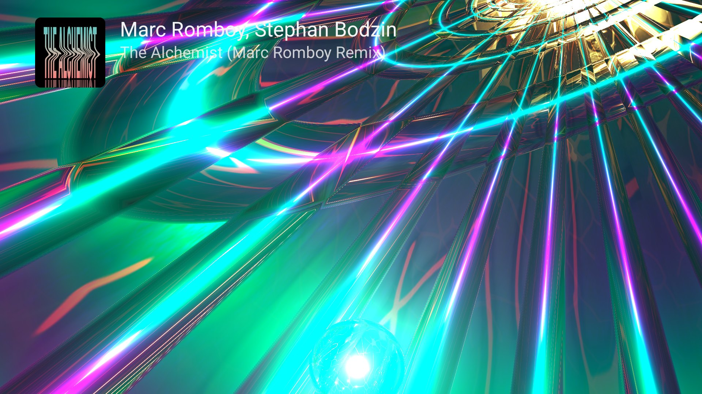
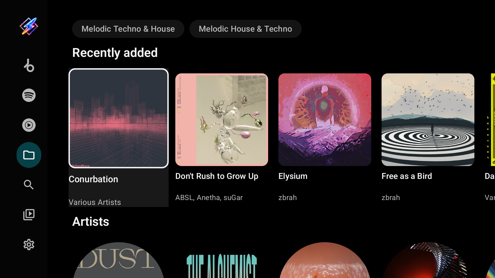
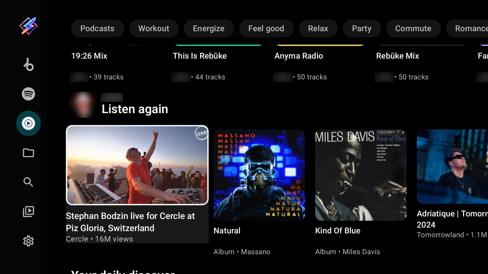
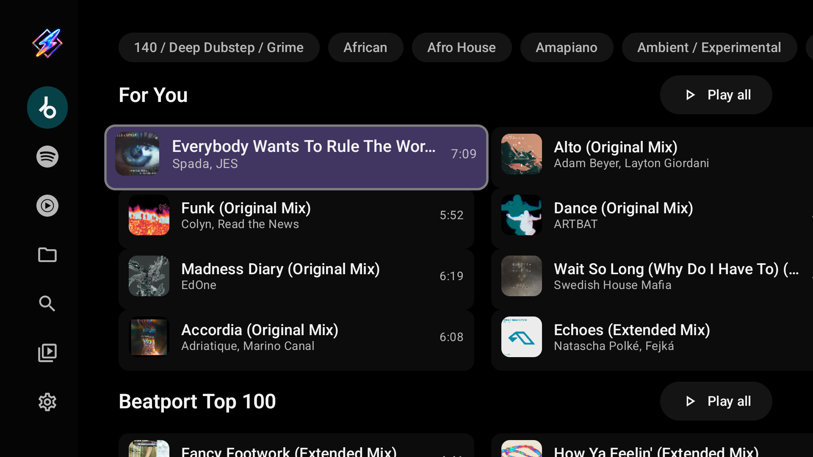
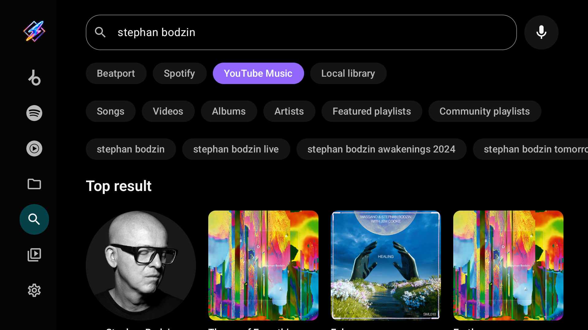
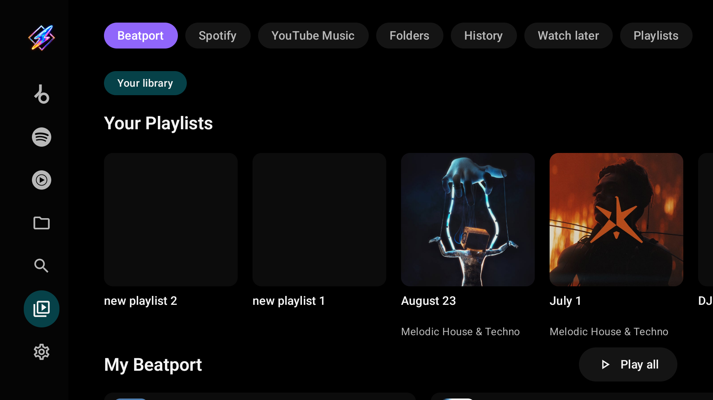
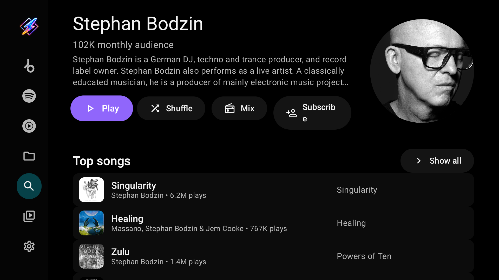
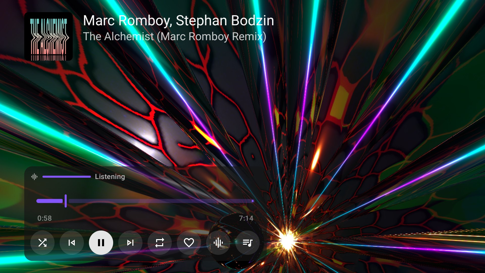
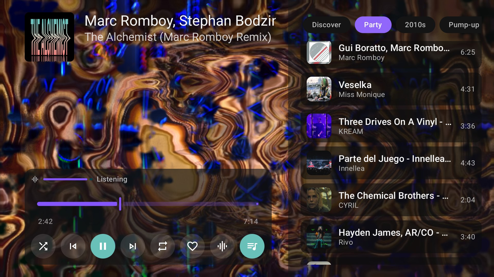

**A music player for Android TV: your own files, network shares and streaming catalogs, with MilkDrop visuals behind every track.**

---

Milkbeat plays music from your TV's storage, USB drives and network folders (SMB, WebDAV, SFTP
and NFS) without any plugin or account. Optional plugins add YouTube Music, Spotify, Beatport and
SoundCloud, each as its own tab in the sidebar, and let one service's catalog play through another
service's audio. Behind the music runs [ProjectM TV](https://github.com/johnneerdael/ProjectM-TV),
a MilkDrop visualizer up to 4K, or the music video, or the cover. Everything is built for the remote.

> **Install on your TV with the Downloader app: code `7170062`**
>
> Install [*Downloader* by AFTVnews](https://play.google.com/store/apps/details?id=com.esaba.downloader&hl=en), enter **7170062** and install the APK. The code always points to
> the newest release. Details under [Install](#install).

  

## User guide

**[johnneerdael.github.io/Milkbeat](https://johnneerdael.github.io/Milkbeat/)** is the illustrated
guide: installation, the music tabs, Search and Library, local and network folders, every plugin
and sign-in method, playback and radio, the visualizer, every Settings page and troubleshooting.

## Highlights

- **A tab per music service.** Every catalog you can use gets its own sidebar tab with its logo:
  YouTube as soon as YouTube Music or YouTube Video is installed, the others once you are signed in. There is no
  metadata provider to choose any more, and Milkbeat opens on the tab you used last.
- **Your own music first.** Local folders, USB drives and SMB 2/3, WebDAV, SFTP and NFS (v3, 4.0,
  4.1) servers, read-only. Their tags build a **Local library** tab of genres, artists, releases,
  playlists, labels and years.
- **Catalog and audio are separate.** YouTube tracks use their known recording IDs; SoundCloud
  and Beatport try their own audio first. Spotify races enabled audio providers and plays the first
  acceptable, playable match. Recording identity is checked, so a
  cover, another remix or a short excerpt is rejected.
- **Every queue continues as a radio,** steered by YouTube Music's presets (Discover, Popular,
  Deep cuts, moods and decades) pinned above the queue. Local music seeds a radio too while the
  file keeps playing.
- **Optional private playlists:** a Spotify playlist can be prepared as a private YouTube Music
  copy, so autoplay follows the whole playlist rather than its first song.
- **Visualizer, music video or artwork.** 9,606 MilkDrop presets from the ProjectM TV engine,
  reacting to Milkbeat's own audio, up to 4K with automatic resolution. Artwork uses the accepted
  audio provider's best available thumbnail, with the original catalog cover as a fallback.
- **Plugins that keep themselves current:** automatic plugin updates, with anything asking for
  new permissions waiting for your review.
- **Robust playback:** whole songs buffer ahead, failed streams resume the same recording, and
  silent output is detected and reconnected.

## A tour

<table>
  <tr>
    <td></td>
    <td></td>
  </tr>
  <tr>
    <td></td>
    <td></td>
  </tr>
  <tr>
    <td></td>
    <td></td>
  </tr>
  <tr>
    <td></td>
    <td></td>
  </tr>
  <tr>
    <td></td>
    <td></td>
  </tr>
</table>

## Music tabs, Search and Library

| Tab | Appears |
| --- | --- |
| **YouTube** | As soon as the YouTube Music or YouTube Video plugin is installed and enabled; sign-in is optional |
| **Spotify**, **Beatport**, **SoundCloud** | Once installed, enabled and signed in |
| **Local library** | Once a music folder is linked |

The YouTube Video plugin shares the YouTube tab, which is named YouTube whichever plugin provides it:
with YouTube Music also installed, the tab shows YouTube Music's catalog; with only YouTube Video, it
shows YouTube Video's. Each tab shows that provider's own feed through Milkbeat's TV components and keeps its place while
you visit another. **Search** offers a chip per music tab, including Local library (video search comes with the
YouTube Video plugin's own chip), each with only its own provider's filters and suggestions (Local library suggests only your recent searches). **Library** starts with a chip per signed-in
account, then Folders, History, Watch later and Playlists (app and provider playlists together,
including Liked songs). Pages opened from a tab, chip or page stay on their provider, the tab they
came from stays highlighted, and pressing it again returns to its first page.
[More in the guide](https://johnneerdael.github.io/Milkbeat/library/).

## Local and network folders

No plugin or streaming account is needed.

1. Open **Settings → Music folders**.
2. **Choose local folder** opens Milkbeat's D-pad browser for the TV's storage and USB drives.
   Storage access is asked for only then: a read-storage prompt on Android 10 and older, Android's
   all-files access settings on 11 and newer. **Use Android folder picker** grants one folder only.
3. For a NAS or computer, choose **Add SMB share**, **Add WebDAV server**, **Add SFTP server** or
   **Add NFS export**, fill in the server, select **Test access**, then **Save**.
4. Browse it under **Library → Folders**, or by tags in the **Local library** tab.

MP3, FLAC and M4A have been tested, including seeking and embedded artwork; other formats depend
on the device's codecs. The Local library index updates when sources change; **Rescan library**
scans on demand. SFTP asks you to confirm the server's key; NFS exports must allow non-privileged
ports. [Every field and requirement](https://johnneerdael.github.io/Milkbeat/folders/).

## Optional streaming plugins

Add **third-party plugins** in **Settings → Plugins** with their downloader codes:

<!-- plugin-codes:readme -->
| Third-party plugin | Downloader code | Original code, still supported |
| --- | --- | --- |
| Beatport | **393** | 102 |
| Spotify | **981** | 772 |
| YouTube Music | **494** | 416 |
| SoundCloud | **089** | — |
| YouTube Video | **932** | — |
<!-- /plugin-codes -->

A plugin download URL also works, including a supported Buzzheavier file page. Plugins are
distributed separately from Milkbeat releases, signature-checked and reviewed before installation.

| Plugin | Catalog | Audio | Video |
| --- | --- | --- | --- |
| YouTube Music | Home, Search, artists, albums, playlists, library | Streams, matching and radio | YouTube videos, channels and playlists |
| Spotify | Home, Search, artists, albums, playlists, library | **None: use another audio provider** | — |
| Beatport | Catalog, genres, charts, artists, labels, library | Full streams with a streaming subscription | — |
| SoundCloud | Discover, Stream, Search, Artists, albums, playlists, Liked Songs, history | Available full tracks, matching and stations | — |
| YouTube Video | YouTube's TV Music Home, Search, artists, albums, playlists, library | Streams, matching and radio | YouTube videos and playlists |

**YouTube Video 0.2.0** is a separate provider for stable Milkbeat, installed with code **932**.
It requires plugin API 8 and keeps its own account alongside
YouTube Music. It supplies SmartTube's regular YouTube TV Music feeds, TV-code/QR sign-in and
native SABR playback through Milkbeat's existing Media3 player.
[Setup and limitations](docs/user-guide/providers.md#youtube-video).

- **YouTube Music:** sign-in is optional and personalizes Home; free accounts work.
- **Spotify:** sign in for your feed, playlists and library; playback comes from your audio providers.
- **Beatport:** sign in for the catalog and library; Beatport's own full-length audio needs a
  streaming subscription, otherwise another provider can match the recording.
- **SoundCloud:** pair with a TV code from any phone. Full-track availability depends on the
  recording and your listening subscription. TV-paired accounts currently play clear HLS streams only.
- **YouTube Video:** works signed out; pairing with a TV code from any phone personalizes Home and
  Library.

Under **Audio**, enable providers and put them in priority order; under **Video**, choose the video
plugin. Native tracks try their own enabled audio provider before ordered fallback; Spotify races
enabled providers. **Update plugins automatically** (on by default) installs new plugin versions at start and
every six hours; **Update all plugins** checks now. A plugin version that needs a newer Milkbeat is
not downloaded: Settings → Plugins says to update Milkbeat first and, in the GitHub build, opens the
app updater. Each plugin's details offer sign-in, play
reporting, **Index playlists** and, for Spotify, **Prepare private playlists in YouTube Music**.
[Providers and sign-in](https://johnneerdael.github.io/Milkbeat/providers/).

## Playback, queue and radio

**OK** in the full player shows the controls: audio level, seek bar, shuffle, previous,
play/pause, next, repeat, like, the view button and the queue.

- **The view button** steps through the visualizer, the matched music video (up to the TV's physical
  resolution, capped at 2160p, in a hardware-decoded codec) and the artwork. Milkbeat remembers your choice; video only loads when
  you pick it.
- **Prepared video playback:** API 7 providers can supply audio and optional picture metadata together. Switching views selects the video track in the existing Media3 presentation; it does not replace or seek the playing audio. Prepared network video buffers briefly behind a loading indicator before joining the current audio position. The indicator stops animating while paused or hidden. Video is offered only when the current presentation contains a supported video track. Older providers with separate progressive picture URLs remain audio-only unless they supply a prepared presentation. Lyrics are not fetched or displayed.
- **The queue** shows what is coming. Every queue continues as a radio; press Right on a track to
  reach the radio presets and switch the mix without losing your own tracks.
- **Queue preparation** matches the remaining queue one track at a time in playback order and
  caches matches.
- **Listening history:** compatible API 8 providers report qualified signed-in listens during playback, including long sets, while respecting the play-reporting setting and skipped sections.
- **Recovery:** about 16 MB of a stream buffers ahead. Failed links get one provider refresh; repeated media failures try the next configured audio provider for that track. Decoded PCM output that stalls for five seconds is reconnected up to twice.

[Playback, queue and radio](https://johnneerdael.github.io/Milkbeat/playback/).

## The visualizer

Milkbeat embeds the [ProjectM TV](https://johnneerdael.github.io/ProjectM-TV/) engine: 9,606
presets from Jason Fletcher's *Cream of the Crop* collection, fed by Milkbeat's own player (no
microphone or recording permission). Resolution is always automatic, following the frame-rate
target and live memory up to the panel's native size, including 4K. Settings → Visualizations
offers preset duration and beta moods (Chill, Normal, Intense), beat cuts, blank and slow preset
skipping, transition length and style, Native trails, frame rate, detail, diagnostics and a
timing offset. With the controls hidden, Left and Right change the preset.
[The visualizer in Milkbeat](https://johnneerdael.github.io/Milkbeat/visualizer/) gives the
overview; [ProjectM TV's guide](https://johnneerdael.github.io/ProjectM-TV/) covers every option in depth.

## Settings

| Category | Contains |
| --- | --- |
| **Plugins** | Audio priority, video provider, installed plugins and their details, automatic plugin updates, Add a plugin |
| **Music folders** | Local folder browser, Android folder picker, SMB, WebDAV, SFTP and NFS editors, Rescan library, saved sources |
| **Playback** | Background Play, Autoplay related videos, Subtitles, Skip Silence, Stable Voice, Ambient mode, Debug playback logging |
| **Visualizations** | The ProjectM TV presets, transitions, picture quality, diagnostics and timing settings |
| **About** | Version, automatic app updates (GitHub build), Changelog, GitHub and credits |

[Every setting with screenshots](https://johnneerdael.github.io/Milkbeat/settings/).

## Requirements and limits

- Android TV, Google TV or Fire TV on Android 8.0 (API 26) or newer. No touch or phone layout.
- Developed and tested on an Ugoos AM6 (Amlogic S922X, 32-bit) and an Ugoos AM9 Pro (64-bit,
  Android 14). The guide's current screenshots come from a 4K Smart TV Pro box on Android 14.
- The visualizer needs OpenGL ES 3.0 and is on by default with about 2 GB of RAM or more.
- Streaming plugins are third-party downloads; what they can play depends on each account,
  subscription and catalog. Matching cannot guarantee the same recording exists elsewhere.
- HLS, DRM, encrypted provider audio (plugin API 9 stream ciphers) and native SABR streams play but
  cannot be downloaded for offline use.

## Install

| Method | How |
| --- | --- |
| **Downloader app** (Google TV, Fire TV, NVIDIA SHIELD) | Install [Downloader by AFTVnews](https://play.google.com/store/apps/details?id=com.esaba.downloader&hl=en) and enter code **`7170062`** |
| **Direct link** (always the latest build) | https://github.com/johnneerdael/Milkbeat/releases/latest/download/milkbeat-universal.apk |
| **All builds** | [Releases](https://github.com/johnneerdael/Milkbeat/releases): every successful `main` build is published with release notes |

Each release also has smaller per-ABI APKs (`milkbeat-arm64-v8a.apk`, `milkbeat-armeabi-v7a.apk`).
Installing a newer release over the existing app keeps data and sign-ins; the GitHub build can
update itself (Settings → About → Automatic updates). A separate **Milkbeat Preview** app for
testing upcoming playback changes installs next to the stable one; see the
[preview guide](https://johnneerdael.github.io/Milkbeat/preview-testing/).

**Coming from MusicViz?** Milkbeat is the same app under a new name and application ID
(`nl.neerdael.milkbeat`), so it installs next to MusicViz instead of over it. Sign in again in
Milkbeat, then uninstall MusicViz. Downloader code `4718521` and the old `musicviz-universal.apk`
link still work and now install Milkbeat.

## Verifying authenticity

Check the signing certificate of a downloaded APK with a tool such as
[AppVerifier](https://github.com/soupslurpr/AppVerifier).

**Milkbeat release certificate SHA-256 fingerprint:**
`FE:FB:39:D0:D5:F3:DF:3B:BB:D0:B7:CC:F7:FE:D7:16:A0:A1:3E:BD:17:AC:52:9B:0C:1A:8E:C3:C1:F7:A3:F8`

## Built on

Milkbeat is a fork of [Flow](https://github.com/A-EDev/Flow) by A-EDev, which laid the groundwork:
the player, YouTube and YouTube Music extraction, and the on-device recommendation engine.

It also builds on:

- **[projectM](https://github.com/projectM-visualizer/projectm)**, the visualizer, through
  [ProjectM TV](https://github.com/johnneerdael/ProjectM-TV), with presets from Jason Fletcher's
  *Cream of the Crop* collection (CC0)
- **[Metrolist](https://github.com/MetrolistGroup/Metrolist)**: the YouTube Music home, radio and
  mix behaviour the queue follows
- **[NewPipeExtractor](https://github.com/TeamNewPipe/NewPipeExtractor)** and
  **[NewPipe](https://github.com/TeamNewPipe/NewPipe)**: YouTube data extraction
- **[PipePipe](https://codeberg.org/NullPointerException/PipePipe)** and its
  [developer docs](https://priveetee.github.io/Docs-PipePipe/): SABR and InnerTube playback
- **[LibreTube](https://github.com/LibreTube/LibreTube)**: SponsorBlock and DeArrow handling
- **[SmartTube](https://github.com/yuliskov/SmartTube)**: the parallel YouTube Video provider's
  TV Music, account and playback approach, with pinned native SABR adaptation
- **[Media3 / ExoPlayer](https://github.com/androidx/media)**,
  **[Jetpack Compose](https://developer.android.com/jetpack/compose)** and
  **[Material Design 3](https://m3.material.io/)**

## License

Milkbeat is free software under the **GNU General Public License v3**: see [License](License).
See the license for the terms governing copying, modification and distribution.

Copyright © 2025-2026 A-EDev (Flow) · Copyright © 2026 John Neerdael (Milkbeat changes)
