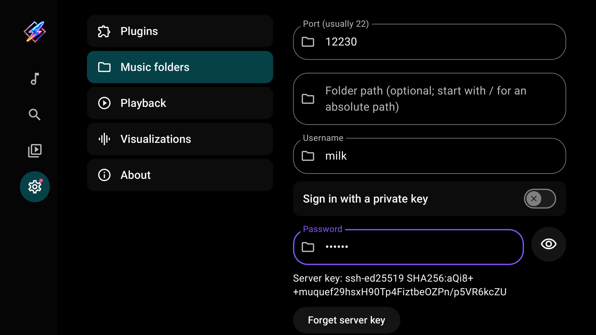
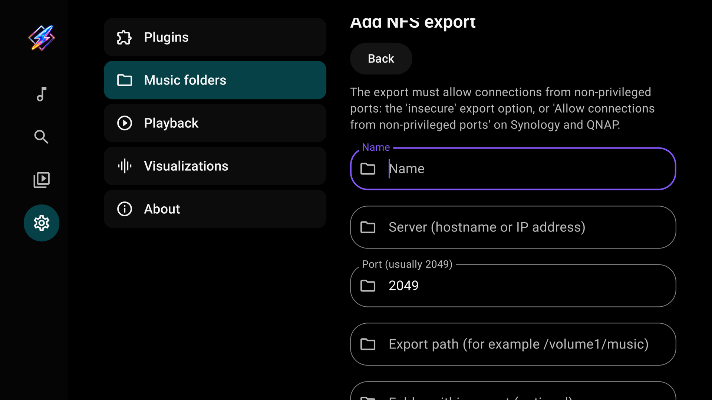

# Local and network folders

[User guide](index.md)

## Add a local or USB folder

1. Open Settings → Music folders.
2. Select **Choose local folder**.
3. In Android's folder picker, choose the folder and grant access.
4. Open Library → Folders and select the saved source.

A USB drive must be mounted and exposed by the device's folder picker. Folder-picker support differs between TV devices. The grant applies to the chosen folder and its children; moving or disconnecting storage can make the source unavailable.

## Add an SMB share

Open Settings → Music folders → **Add SMB share**.

| Field | Enter |
| --- | --- |
| Name | A label for this source |
| Server | The hostname or IP address, without `smb://` |
| Port | Usually `445` |
| Share name | The exported share's name, such as `Music` |
| Folder within share | Optional path beneath that share; leave empty for its root |
| Guest access | Enable only when the server permits guest access |
| Username / Password | The account the server accepts when guest access is off |
| Domain | Optional; use it only if your server requires one |

Select **Test access**. When access is confirmed, select **Save**. Testing alone does not save the source. Milkbeat supports SMB 2/3 and reads files without modifying the share. The password field has a Show/Hide control; leaving an existing saved password unchanged keeps it.

## Add a WebDAV server

Open Settings → Music folders → **Add WebDAV server**. Nextcloud, ownCloud, Synology, QNAP, Apache and `rclone serve webdav` work.

| Field | Enter |
| --- | --- |
| Name | A label for this source |
| Server URL | The full address of the music folder, such as `https://nas.local/webdav/Music` or `https://cloud.example.com/remote.php/dav/files/you/Music`. Do not put a username or password in the URL |
| Anonymous access | Enable only when the server allows access without an account |
| Username / Password | The account the server accepts when anonymous access is off |

Milkbeat signs in with HTTP Basic authentication. With an `http://` address the username and password travel unencrypted, and the editor warns you; prefer `https://` unless the server is on a network you trust. Servers that require Digest authentication or use a self-signed certificate are not supported.

## Add an SFTP server

Open Settings → Music folders → **Add SFTP server**. Any server that offers SSH file transfer works, including most NAS devices and Linux machines.

| Field | Enter |
| --- | --- |
| Name | A label for this source |
| Server | The hostname or IP address |
| Port | Usually `22` |
| Folder path | Optional. A path starting with `/` is absolute, such as `/srv/music`; otherwise it is relative to the account's home folder |
| Username | The SSH account |
| Sign in with a private key | Off: sign in with the password. On: select **Choose private key file** and pick an OpenSSH, PEM or PuTTY key; the password field then holds the key's passphrase, if it has one |

The first **Test access** or **Save** only fetches the server's key fingerprint, for example `ssh-ed25519 SHA256:…`; your password or key is not used yet. Compare it with the server's own fingerprint (`ssh-keygen -lf /etc/ssh/ssh_host_ed25519_key.pub` on the server). If it matches, select **Test access** to sign in or **Save** to trust it. Milkbeat refuses to connect if the server later presents a different key. If you replaced or reinstalled the server, select **Forget server key** and confirm the new fingerprint the same way.

## Add an NFS export

Open Settings → Music folders → **Add NFS export**. NFS versions 3, 4.0 and 4.1 are supported. A server that also offers NFSv4.2 works over 4.1; one that accepts only 4.2 does not.

| Field | Enter |
| --- | --- |
| Name | A label for this source |
| Server | The hostname or IP address |
| Port | Usually `2049` |
| Export path | The exported folder, such as `/volume1/music`. For an NFSv4 server that exports a pseudo-root, `/` works too |
| Folder within export | Optional path beneath the export |
| NFS version | **Automatic** tries 4.1, then 4.0, then 3. Choose a fixed version if your server needs one |
| User ID / Group ID | The numeric IDs Milkbeat presents to the server. `0` is usually mapped to an anonymous user by the server; use the IDs of an account that can read the music if files are not world-readable |

The export must accept connections from non-privileged ports, because Android apps cannot use ports below 1024. On Linux add `insecure` to the export's options in `/etc/exports`; on Synology and QNAP enable **Allow connections from non-privileged ports**. Without it, Test access reports that the server only accepts privileged ports.

Network folders are read-only: Milkbeat never changes files on the server. Names that contain `:` are supported on WebDAV, SFTP and NFS. Symbolic links inside SFTP and NFS folders are not followed, because their targets can lie outside the configured folder; set the folder path to the real location instead.

## Browse and play

In Library → Folders, select a source, then a folder. **Parent folder** moves up within the source. Select a track to play it, or **Play folder** to queue music in the current folder. Playback does not require a metadata or audio plugin.

Embedded title, artist, album, duration and cover art load in the background for visible or playing tracks. MP3, FLAC and M4A have been tested; other formats depend on device codecs. Files without readable tags fall back to their filenames and source labels.

## Refresh, edit or remove

Use **Refresh** to reload a source's listing and metadata. Open the source in Settings → Music folders to edit or remove it. Removing the source removes Milkbeat's configuration and saved passwords or keys, not the music files on the storage device or server.

Folder music currently uses folder browsing and a bounded memory cache. It does not maintain a persistent whole-library catalog with artist, genre or record-label browsing.
