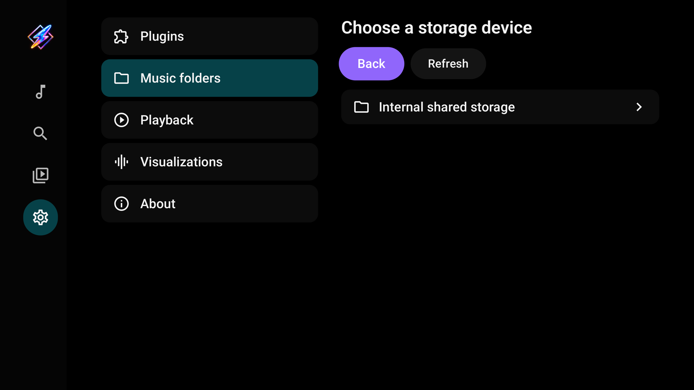
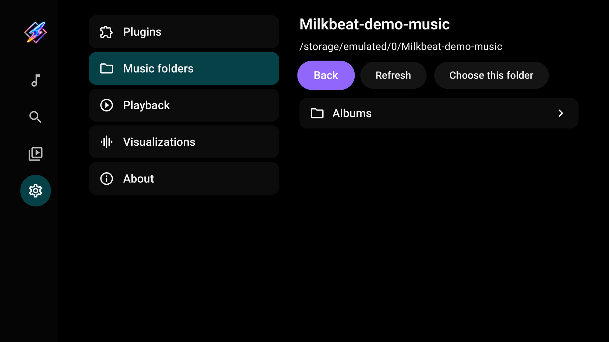
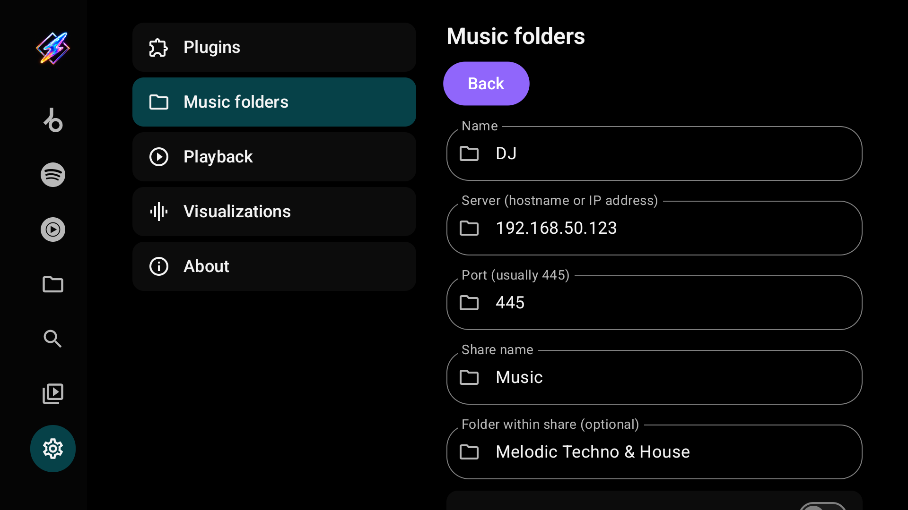
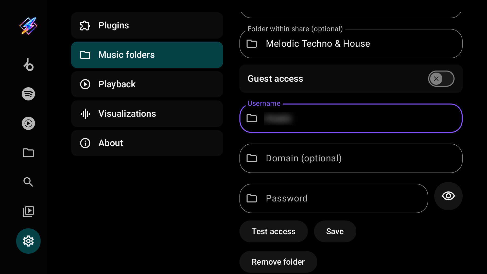
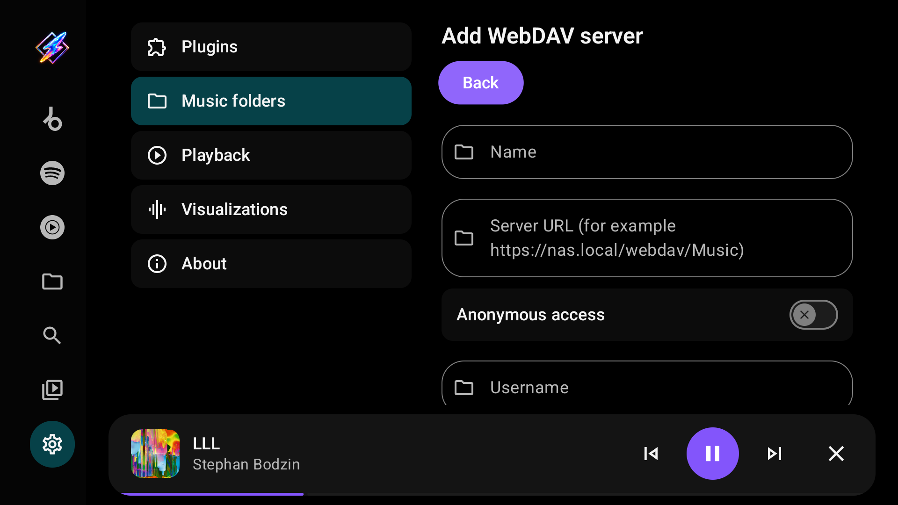

# Local and network folders

Milkbeat plays music from the TV's own storage, USB drives and network servers without any plugin or streaming account. Every source is read-only: Milkbeat never changes your files.

## Add a local or USB folder

1. Open Settings → Music folders.
2. Select **Choose local folder**.
3. If needed, allow storage access: Android 10 and older show a read-storage permission prompt; Android 11 and newer open Android's **All files access** settings. Select Milkbeat if Android shows a list of apps, then enable access and return to Milkbeat.
4. Choose the TV's storage or a mounted USB/SD drive. Use the remote to open folders, then select **Choose this folder**.
5. Open Library → Folders and select the saved source.

Storage permission is not requested at startup or just by opening Settings. It is requested only when selecting **Choose local folder**. The browser runs inside Milkbeat and supports D-pad navigation, Back and Refresh. Milkbeat reads the selected folder; it does not modify your music. Android's permission covers more than the selected folder: on newer versions, all-files access also permits writes, although this browser only reads.

If permission is denied, network folders and the rest of Milkbeat remain usable. **Storage permissions** opens Android settings to retry. Alternatively, **Use Android folder picker** uses the device's system picker to grant access to just one folder. Previously saved system-picker sources continue to work.

A USB drive must be mounted by Android. Select **Refresh** after connecting a drive. Moving or disconnecting storage can make a saved source unavailable; reconnect it and refresh. Device firmware controls which mounts are accessible. Symbolic links that leave the selected folder or lead back to an ancestor are not followed. Multiple aliases of the same file or directory appear once.

## Add an SMB share

Open Settings → Music folders → **Add SMB share**.

| Field | Enter |
| --- | --- |
| Name | A label for this source |
| Server | The hostname or IP address, without `smb://` |
| Port | Usually `445` |
| Share name | The exported share's name, such as `Music` |
| Folder within share | Optional path beneath that share; leave empty for its root |
| Guest access | Enable only when the server permits guest access |
| Username / Password | The account the server accepts when guest access is off |
| Domain | Optional; use it only if your server requires one |

Select **Test access**. When access is confirmed, select **Save**. Testing alone does not save the source. Opening a saved source shows the same editor with **Back** at the top and **Remove folder** at the bottom. Milkbeat supports SMB 2/3 and reads files without modifying the share. The password field has a Show/Hide control; leaving an existing saved password unchanged keeps it.

## Add a WebDAV server

Open Settings → Music folders → **Add WebDAV server**. Nextcloud, ownCloud, Synology, QNAP, Apache and `rclone serve webdav` work.

| Field | Enter |
| --- | --- |
| Name | A label for this source |
| Server URL | The full address of the music folder, such as `https://nas.local/webdav/Music` or `https://cloud.example.com/remote.php/dav/files/you/Music`. Do not put a username or password in the URL |
| Anonymous access | Enable only when the server allows access without an account |
| Username / Password | The account the server accepts when anonymous access is off |

Milkbeat signs in with HTTP Basic authentication. With an `http://` address the username and password travel unencrypted, and the editor warns you; prefer `https://` unless the server is on a network you trust. Servers that require Digest authentication or use a self-signed certificate are not supported.

## Add an SFTP server

Open Settings → Music folders → **Add SFTP server**. Any server that offers SSH file transfer works, including most NAS devices and Linux machines.

| Field | Enter |
| --- | --- |
| Name | A label for this source |
| Server | The hostname or IP address |
| Port | Usually `22` |
| Folder path | Optional. A path starting with `/` is absolute, such as `/srv/music`; otherwise it is relative to the account's home folder |
| Username | The SSH account |
| Sign in with a private key | Off: sign in with the password. On: select **Choose private key file** and pick an OpenSSH, PEM or PuTTY key; the password field then holds the key's passphrase, if it has one |

The first **Test access** or **Save** only fetches the server's key fingerprint, for example `ssh-ed25519 SHA256:…`; your password or key is not used yet. Compare it with the server's own fingerprint (`ssh-keygen -lf /etc/ssh/ssh_host_ed25519_key.pub` on the server). If it matches, select **Test access** to sign in or **Save** to trust it. Milkbeat refuses to connect if the server later presents a different key. If you replaced or reinstalled the server, select **Forget server key** and confirm the new fingerprint the same way.

## Add an NFS export

Open Settings → Music folders → **Add NFS export**. NFS versions 3, 4.0 and 4.1 are supported. A server that also offers NFSv4.2 works over 4.1; one that accepts only 4.2 does not.

| Field | Enter |
| --- | --- |
| Name | A label for this source |
| Server | The hostname or IP address |
| Port | Usually `2049` |
| Export path | The exported folder, such as `/volume1/music`. For an NFSv4 server that exports a pseudo-root, `/` works too |
| Folder within export | Optional path beneath the export |
| NFS version | **Automatic** tries 4.1, then 4.0, then 3. Choose a fixed version if your server needs one |
| User ID / Group ID | The numeric IDs Milkbeat presents to the server. `0` is usually mapped to an anonymous user by the server; use the IDs of an account that can read the music if files are not world-readable |

The export must accept connections from non-privileged ports, because Android apps cannot use ports below 1024. On Linux add `insecure` to the export's options in `/etc/exports`; on Synology and QNAP enable **Allow connections from non-privileged ports**. Without it, Test access reports that the server only accepts privileged ports.

Network folders are read-only: Milkbeat never changes files on the server. Names that contain `:` are supported on WebDAV, SFTP and NFS. Symbolic links inside SFTP and NFS folders are not followed, because their targets can lie outside the configured folder; set the folder path to the real location instead.

## Browse and play

There are two ways to play folder music:

- **Library → Folders** browses a source folder by folder. Select a source, then a folder; **Back to folders** returns to the list and **Refresh** reloads the listing. Select a track to play it, or **Play folder** to queue the music in the current folder.
- The **[Local library](library.md#local-library)** tab organizes the same files by their tags into artists, releases, playlists, genres, labels and years.

Embedded title, artist, album, duration and cover art load in the background for visible or playing tracks. MP3, FLAC and M4A have been tested, including seeking and embedded artwork; other formats depend on the device's codecs. Files without readable tags fall back to their filenames.

Local audio always plays from its file. With an enabled YouTube Music plugin, Milkbeat matches the first queued song's title, artists and duration in the background only to seed [radio](playback.md#radio-and-its-presets); it never swaps the local file for a stream. Without the plugin, a connection or a match, the local queue still plays.

## The local library index

The Local library keeps a persistent index of your folders' tags. A scan starts when you add, edit or remove a source, and when Milkbeat starts with an index more than six hours old; it reads only the files that changed. While it reads files, the tab shows **Indexing your music library** with a file count, and Android shows a **Scanning music folders** notification. **Rescan library** in Settings → Music folders starts a scan straight away, for example after retagging files on the server. The Folders browser itself uses a bounded in-memory cache.

## Refresh, edit or remove

Use **Refresh** in a folder to reload its listing and metadata. Open the source in Settings → Music folders to edit it, or select **Remove folder**. Removing a source deletes Milkbeat's configuration and its saved password or key, never the music on the device or server.
