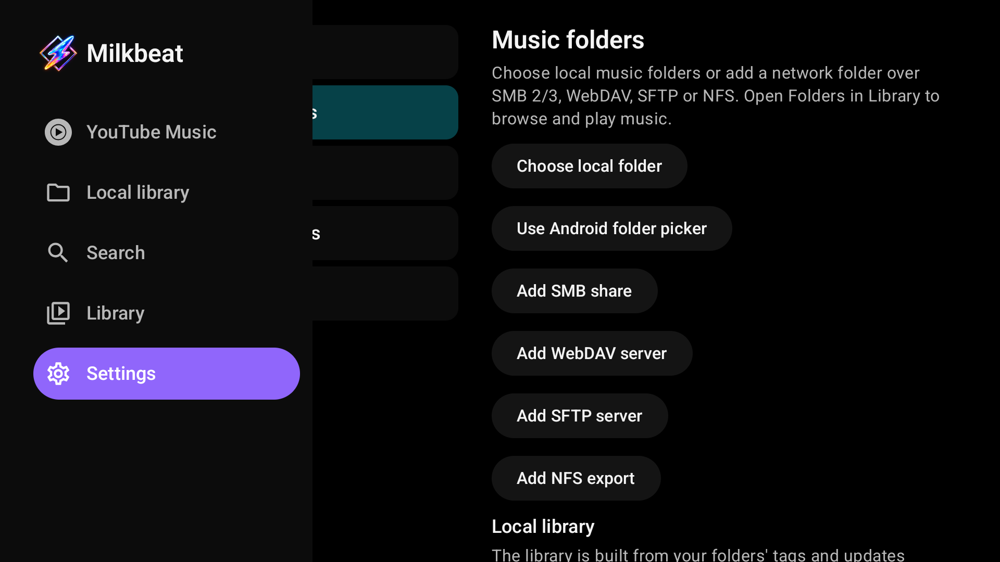
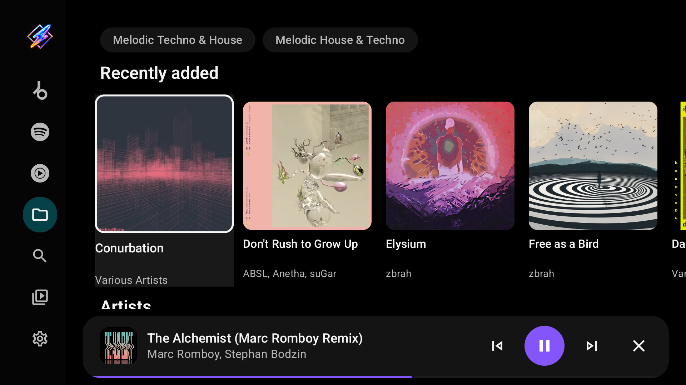

# Install and get started

Milkbeat runs on Android TV, Google TV and Fire TV with Android 8.0 or later. It is built for the TV remote and has no touch or phone layout.

## Install on the TV

=== "Downloader app"

    1. Install [*Downloader* by AFTVnews](https://play.google.com/store/apps/details?id=com.esaba.downloader&hl=en) from the TV's app store and allow it to install apps.
    2. Open it and enter code **`7170062`**.
    3. Install the APK it downloads, then start **Milkbeat** from the launcher.

    The code always points to the newest release.

=== "Direct download"

    1. Open the [latest release](https://github.com/johnneerdael/Milkbeat/releases/latest).
    2. Download `milkbeat-universal.apk` if you are unsure of your device's architecture.
       Smaller `milkbeat-arm64-v8a.apk` and `milkbeat-armeabi-v7a.apk` files are also attached.
    3. Open the APK with the TV's installer, allowing installs from that source if Android asks.

Installing a newer release over the existing app keeps its data, plugins and sign-ins. Uninstalling first removes them. The GitHub build updates itself if you leave **Automatic updates** on under [Settings → About](settings.md#about).

!!! note "Coming from MusicViz?"
    Milkbeat is the same app under a new name and application ID (`nl.neerdael.milkbeat`), so it installs next to MusicViz rather than over it. Sign in again in Milkbeat, then uninstall MusicViz. Downloader code `4718521` still works and now installs Milkbeat.

## First playback

Pick whichever fits your music; you can add the others later.

-   :material-folder:{ .lg .middle } **Your own files**

    ---

    Settings → Music folders → **Choose local folder**, or add an SMB, WebDAV, SFTP or NFS server. No plugin or account is needed.

    [:octicons-arrow-right-24: Add a folder](folders.md)

-   :material-puzzle:{ .lg .middle } **A streaming catalog**

    ---

    Settings → Plugins → enter a three-digit plugin code, install it and sign in if the provider needs one.

    [:octicons-arrow-right-24: Install a plugin](providers.md#install-a-plugin)

Each provider or folder you can use gets its own tab in the sidebar. Until there is one, a single **Music** tab offers to add a plugin or a music folder.

## Find your way around

Press **Left** from the content to open the sidebar. The upper part holds one tab per music service plus **Local library**; below them are **Search**, **Library** and **Settings**. Milkbeat opens on the music tab you used last. The [browsing guide](library.md) explains each part.

While music plays, a bar at the bottom shows the track with previous, play/pause, next and close. Select the bar to open the full player.

## Remote controls

| Key | In menus and pages | In the full player |
| --- | --- | --- |
| ++arrow-up++ ++arrow-down++ ++arrow-left++ ++arrow-right++ | Move focus | With controls hidden: Left and Right step through visualizer presets |
| ++enter++ (OK / centre) | Open or activate the focused item | Show the playback controls |
| Back | Close a panel, or return to the previous page | Hide the controls, then leave the player |
| Hold Up or Down in the queue | Scroll repeatedly, accelerating through a long queue | |
| Media keys | Play/pause, previous and next control the playing queue | |

Settings has its categories on the left and their controls on the right. Selecting a category again returns to its first page; pickers open as a side panel that Back closes.
