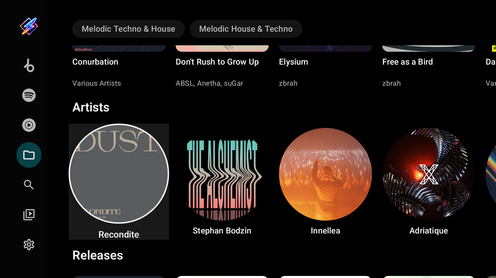
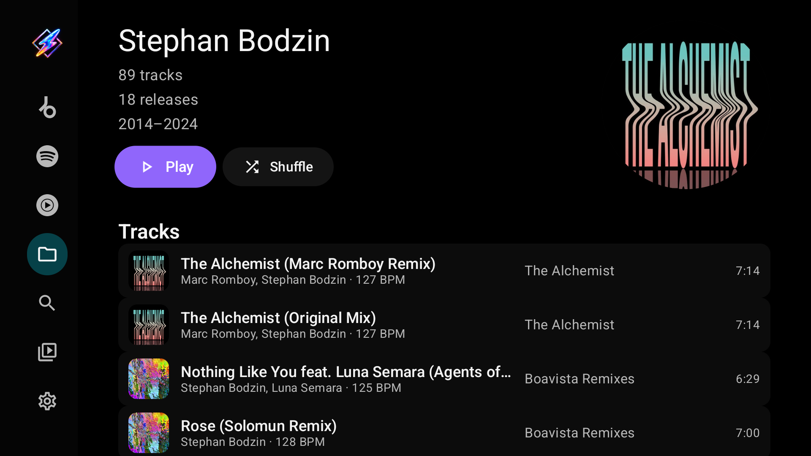
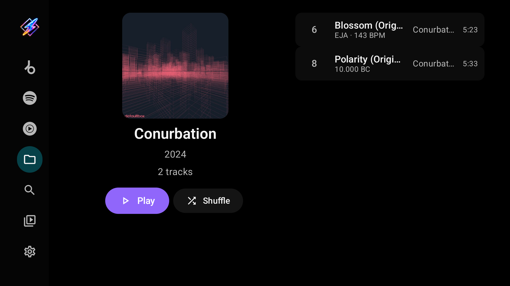
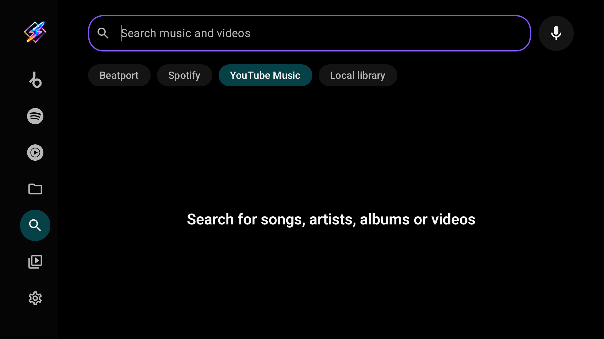
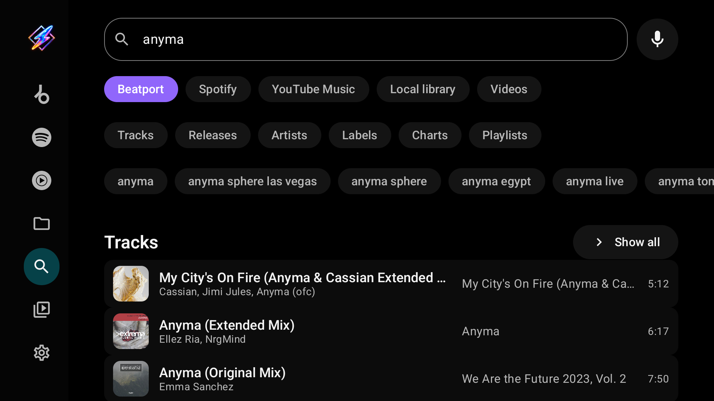
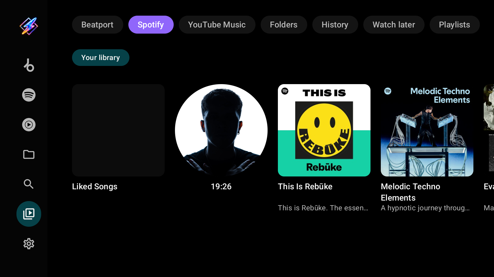
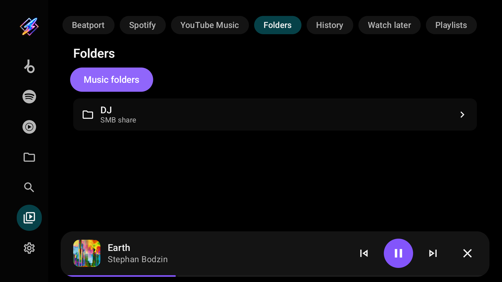
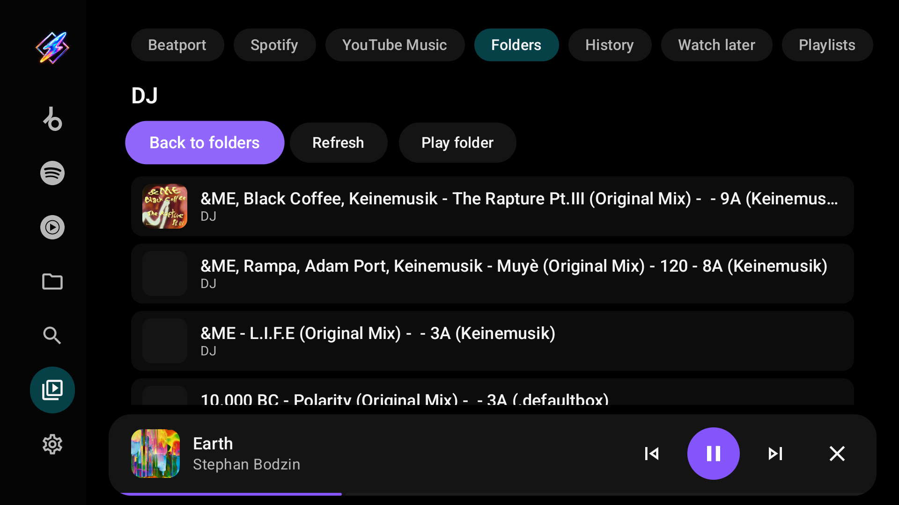
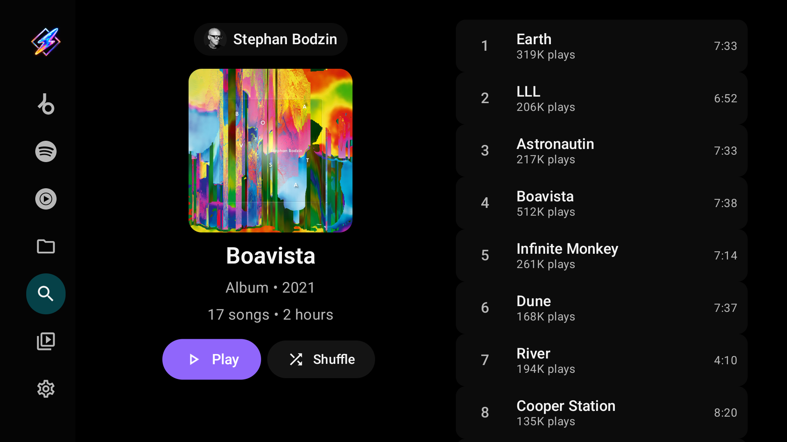
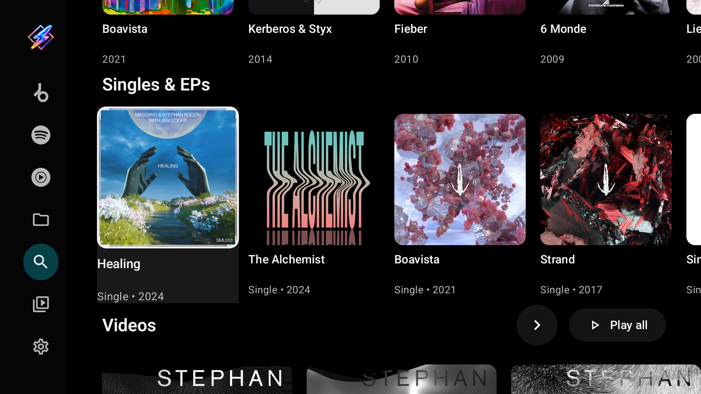

# Music tabs, Search and Library

Milkbeat has no "metadata provider" setting any more. Instead, every music catalog you can use appears in the sidebar as its own tab, and Search and Library offer one chip per provider. Whatever you open from a tab, chip or page stays on the provider it came from.

## A tab per music service

| Tab | When it appears |
| --- | --- |
| **YouTube** | As soon as the YouTube Music or YouTube Video plugin is installed and enabled. Sign-in is optional. With both installed, the one tab shows YouTube Music's catalog; with only YouTube Video, it shows YouTube Video's catalog, also signed out |
| **Spotify**, **Beatport**, **SoundCloud** | Once the plugin is installed, enabled and signed in |
| **Local library** | Once at least one music folder is linked |
| **Music** | Only while none of the above exists; it offers to add a plugin or a music folder |

Each tab is marked with the service's logo and named after the service, so the YouTube tab and its Search and Library chips read **YouTube** whichever YouTube plugin provides them. It shows that provider's own feed, laid out with Milkbeat's TV components; the provider decides which shelves appear. A tab keeps its scroll position and filters while you visit another, and Milkbeat starts on the music tab you used last. A page opened from a tab keeps that tab highlighted; pressing the highlighted tab returns to its first page. Search and Library keep a page you opened while you visit another tab, while the music tabs always return to their own feed. Signing out of a provider or disabling its plugin removes its tab. Your [audio providers](providers.md#set-audio-priority) handle playback independently of the tab you browse.

=== "YouTube Music"

    

    Mood chips such as Workout, Energize and Relax, Quick picks, albums, mixes, playlists, artist portraits and music-video cards follow the YouTube Music feed. A signed-in account gets personalized shelves such as **Listen again**; anonymous browsing works too.

=== "Spotify"

    

    Spotify supplies its Home shelves (Jump back in, top mixes, radios, recommendations), artists, albums and playlists. It has no audio of its own: playback comes from your audio providers.

=== "Beatport"

    

    Genre chips, For You recommendations, the Beatport Top 100, charts and releases. Artist and label pages use the same catalog layout. Full-length audio from Beatport needs a streaming subscription.

=== "SoundCloud"

    SoundCloud Home offers **Discover** shelves for the signed-in account and a separate **Stream** activity feed, with mixes, stations, playlists, albums and artist portraits. Its library includes playlists, albums, **Artists** (the accounts you follow), Liked Songs and history.

## Local library

The **Local library** tab is built from the tags in your [music folders](folders.md). It opens with your genres as chips, then **Recently added**, **Artists**, **Releases**, **Playlists**, **Labels** and **Years**. Picking a genre chip filters every shelf below it. The index is rescanned when your sources change and when Milkbeat starts with an index more than six hours old; **Rescan library** under Settings → Music folders [scans on demand](folders.md#the-local-library-index).

Artist, release, label, year and genre pages list their tracks with tagged BPM where present. Selecting a track plays that track and then its radio; **Play** and **Shuffle** queue the whole page.

## Search

Search shows a chip for each music tab that can search, including **Local library**. There is no separate video search: install the [YouTube Video plugin](providers.md#the-available-plugins), which brings its own chip, to search videos. It starts on the chip of the music tab you used last. Only the chip on screen searches, so switching chips searches that provider for the same text.

Each provider brings its own filter chips and suggestions, and a chip only ever shows its own provider's suggestions:

YouTube Music offers Songs, Videos, Albums, Artists, Featured and Community playlists; Beatport offers Tracks, Releases, Artists, Labels, Charts and Playlists. **Local library** searches song titles, artists, albums and artist names in your folders; while you type it suggests only matching recent searches, with no provider suggestions. Opening a result uses the page for its type, on the provider of its chip.

## Library

Library starts with a chip for each signed-in provider that has a library. Picking one shows that account's own sections, such as its playlists, saved releases, followed artists and listening history. Provider lists load page by page; an unavailable provider does not hide the others, and a failed page can be retried.

The fixed sections follow the provider chips:

| Section | Contents |
| --- | --- |
| **Folders** | Your configured local and network sources, to browse folder by folder |
| **History** | Music and video activity recorded by the app |
| **Watch later** | Videos saved for later |
| **Playlists** | App playlists and playlists from every enabled, signed-in provider, including **Liked songs** |

Liked videos are not shown in this TV library. When Spotify is signed in and [private playlist preparation](providers.md#prepare-private-playlists) is on, Library hides the managed YouTube copies that duplicate their Spotify source.

## Albums, playlists and artists

Pages are laid out like YouTube Music on the web, with the same components for every provider.

- **Albums and playlists** keep the cover, details, **Play** and **Shuffle** on the left, with the tracks beside them. From Play or Shuffle, Right jumps to the first track.
- **Artists** open on their name, audience, description and portrait, with **Play**, **Shuffle**, **Mix** and **Subscribe**, followed by Top songs, Albums, Singles & EPs, Videos and more.

A Spotify playlist with [private preparation](providers.md#prepare-private-playlists) shows its progress under the description, and a small YouTube mark beside **Private playlist ready** once its copy is complete.
