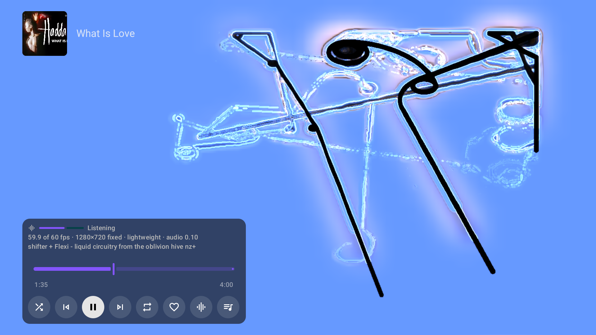
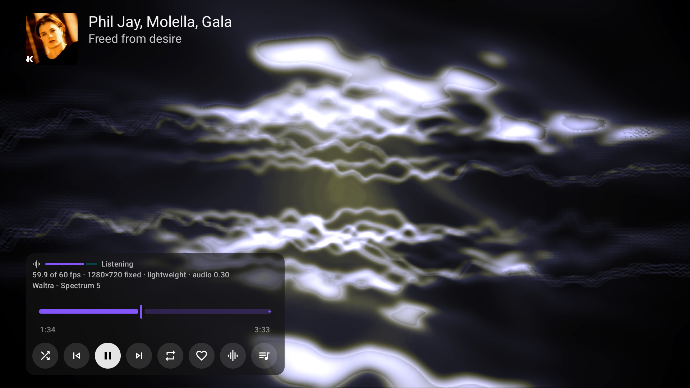
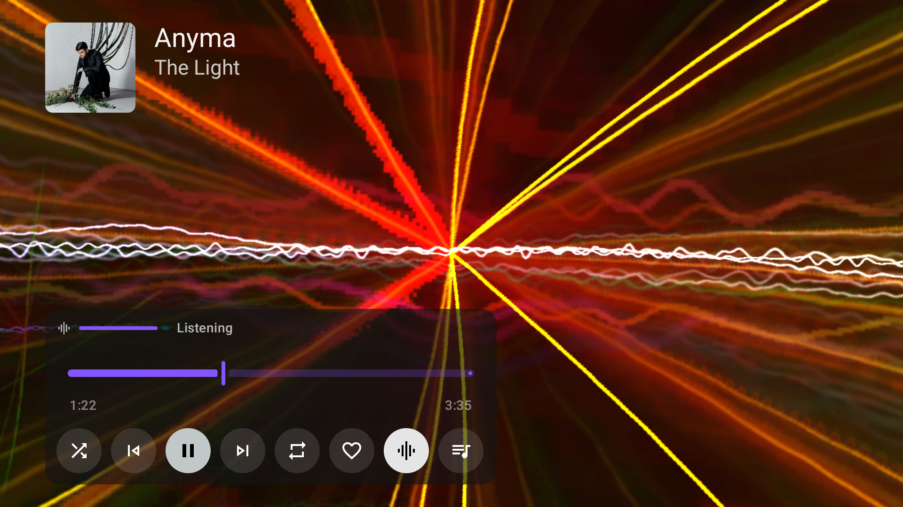
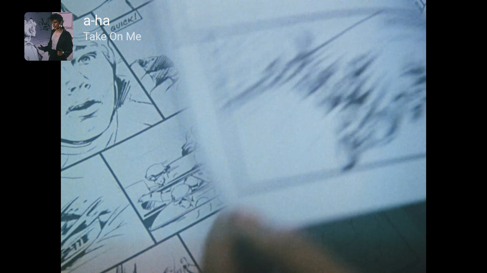
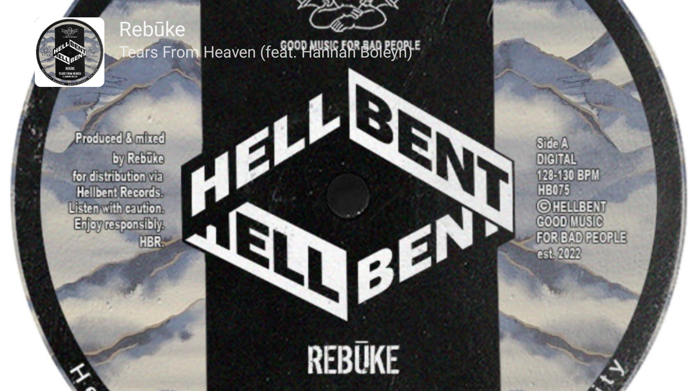

# Playback, queues and visuals

[User guide](index.md)

## Player controls

Press OK in the full music player to show seeking, shuffle, previous, play/pause, next, repeat, like, the view button and the queue. Back closes the current panel or player surface.

## Queues and preparation

Open the queue to inspect upcoming tracks or jump to one. Holding Up or Down accelerates scrolling. Queue preparation follows playback order and matches the entire remaining queue one track at a time while music plays. Jumping elsewhere gives the new playback position priority. Tracks with native audio IDs do not need cross-provider matching. Video-capable audio providers use video matching for ordinary playback, queue preparation and playlist indexing regardless of the chosen view. Successful recording matches stay cached; old Songs-only misses are reconsidered.

When matching streaming recordings, Milkbeat prefers full recordings over mixed excerpts and permits any longer recording when the title, performers and named remix/edit agree, without a duration cap or required full/extended label. Remixer credits may be supplied in either the title or artist list.

Confirmed unmatched tracks can be removed from the future queue. Temporary failures remain retryable. Preparation reduces the work needed at a transition, but does not guarantee gapless playback under every network, format or provider condition.

Streamed music loads well ahead of the playing position: Milkbeat keeps loading until about 16 MB is buffered (roughly 13 minutes of typical audio, so usually the whole song), then loads more once less than 30 seconds of buffered media remain. A stream link that stops answering after a song has loaded therefore no longer interrupts it. The buffer is shared with a music video's picture, so less of the song is held while the video plays, and a slow network or low memory can keep the buffer shorter. If a stream fails, Milkbeat asks the audio provider for a fresh link to the same recording and resumes where it stopped.

## Encrypted provider audio

Compatible plugins can supply Widevine-protected audio through the device's DRM implementation.
Milkbeat fetches licenses separately from audio and limits license destinations to the plugin's
approved network access. Availability depends on the account, recording and device. SoundCloud
previews are not substituted for full tracks, and a creator membership does not imply a listening
subscription. The current offline downloader supports clear progressive audio; HLS playlists and
DRM audio cannot be downloaded for offline playback.

SoundCloud TV-paired accounts currently supply clear HLS playback only. Protected-only recordings
are unavailable through this session: the mobile license exchange has not been validated. Existing
SoundCloud web sessions retain their Widevine path when the recording, account and device allow it.

## Mixes

Once a streaming queue starts playing, Milkbeat seeds a mix from the queue's first song. When the metadata provider has no radio, Milkbeat tries compatible audio providers in priority order.

For normal Spotify playback through YouTube, that first song's matched YouTube ID seeds the radio. [Private playlist preparation](providers.md#why-prepare-a-youtube-playlist) instead gives YouTube the whole matched playlist as its native autoplay context. Milkbeat can then exclude the playlist's matched songs from later suggestions, helping avoid repeats as the radio continuation begins.

Every queue continues as a radio: a [prepared private playlist](providers.md#prepare-private-playlists) from its YouTube copy, anything else from its first song. All the presets YouTube Music offers for that radio (**All**, **Popular**, **Discover**, **Deep cuts**, moods and decades) appear in one scrolling line above the queue; press Right on a queue track to reach them and Down to return to it. Changing the mode replaces upcoming radio-added songs while keeping the playing song, the original playlist and tracks you added yourself. Continuations stay in the selected mode, and the controls remain visible as more suggestions load. Presets only appear when the provider supplies them for the current playback context. The queue keeps space for the focused row’s border even when no presets are available. The controls stay pinned above the scrolling rows; press Back to close the queue. Radio suggestions are not saved into a [prepared private playlist](providers.md#prepare-private-playlists).

Press Right on a queue track to focus the pinned radio presets. Move Left or Right between presets, then press Down to return to the track you left, with the queue's scroll position retained. If that track was removed while you changed the mix, focus falls back to an available row.

Local music keeps playing from its device, USB or network-folder file. With an enabled YouTube
Music plugin, Milkbeat matches the first queued local song's title, artists and duration in the
background and uses that match only to seed YouTube Music radio. It does not replace local audio
with a YouTube stream. A local album, playlist or artist queue uses its first song as the seed.
Collection queues continue with suggestions when endless radio is enabled. Selecting one local
track requests its radio explicitly, as it does for streaming tracks. Without the plugin, a
connection or a confident match, the local queue still plays and earlier radio suggestions are cleared.

Selecting a track in **Local library** plays only that track followed by its radio. This applies
to artist, release, album, playlist, year, genre and label pages. Use the collection's **Play** or
**Shuffle** button to queue the whole collection. **Play folder** queues tracks from the current folder.

## MilkDrop visualizer

The visualizer uses projectM through ProjectM TV, with 9,606 Cream of the Crop presets. Its input comes from Milkbeat's player. With controls hidden, Left and Right step through presets.

Out of the box the engine uses ProjectM TV's defaults for your device: a 30 fps target, automatic resolution and transitions, Standard native trails and slow-preset skipping. Performance varies by preset and device. Resolution and RAM budgeting stay automatic; the frame rate, trails and other offered controls are in [Settings → Visualizations](settings.md#visualizations).

Rendering and audio monitoring stop when the visualizer leaves the screen or the app goes into the background. A visible visualizer can keep drifting on silence when music is paused.

## Timing and diagnostics

Settings → Visualizations contains the visualizer switch, the projectM settings, diagnostics and the timing offset. Resolution adapts automatically to the target frame rate and live memory headroom, up to native 4K on a 4K panel. Native trails defaults to Standard; Medium and High add detail above 1330p and may lower the resolution Auto can sustain. Raise the timing value if the visuals arrive after the beat; lower it if they arrive before. Adjust by listening and watching on your own audio setup.

Diagnostics show measured fps, target fps, render dimensions and the automatic render size, transition state, audio level and preset. Use these values when investigating slow visuals instead of judging performance from a still screenshot.

## What the visualizer settings change

The diagnostics line shows the actual automatic render size and selected FPS target. Raising **Frame rate** can cause Auto to lower resolution; Standard trails and shorter transitions reduce rendering work. The resulting size depends on the preset, device and available memory rather than a fixed-height setting.

With **Transition style** set to Lightweight, presets cut and the old one fades out on top; the line reads `lightweight` instead of `blend`:

With **Change presets automatically** off, a preset stays until you press Left or Right. With **Cut on loud beats** on, a loud beat can cut to the next preset before its duration is up.

## Visualizer, music video or artwork

The view button in the player steps through three views while audio continues: the visualizer (the default), the music video, and the track's cover filling the screen. Milkbeat remembers the view you leave it on for later tracks and later sessions.

A confirmed YouTube audio source can offer Video even when the original SoundCloud or Spotify catalog entry did not advertise a video. Art Tracks with static album artwork are valid video choices. Discovering a match does not start picture loading: select Video with the view button to show it. A track without a usable video skips from the visualizer straight to the artwork, and with the video view chosen it shows the visualizer instead. With visualizations turned off, the button moves between the video and the artwork. Unsupported or unavailable video falls back to audio and visuals.

The video-matching test prerelease runs beside the stable app. See [preview setup and checks](preview-testing.md).
