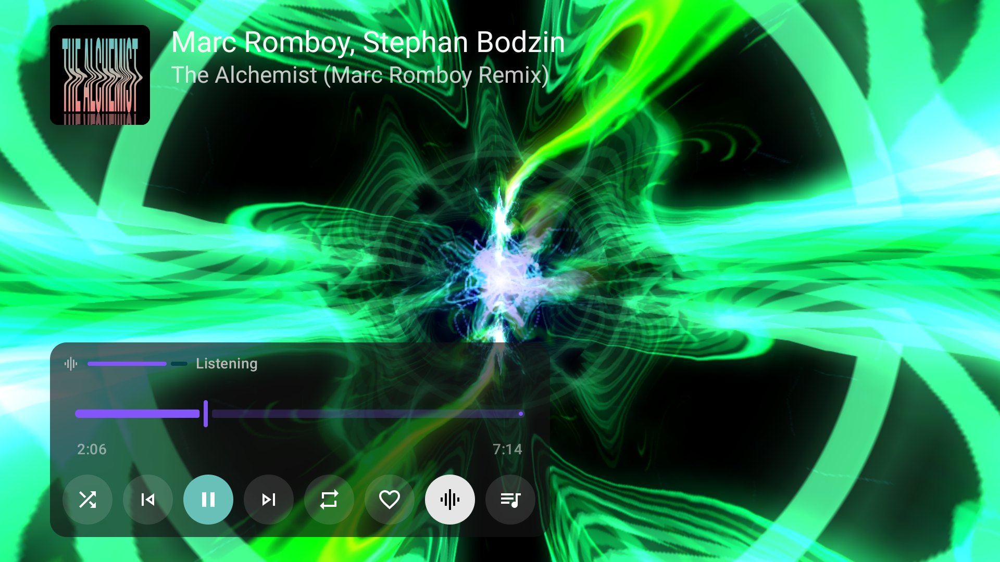
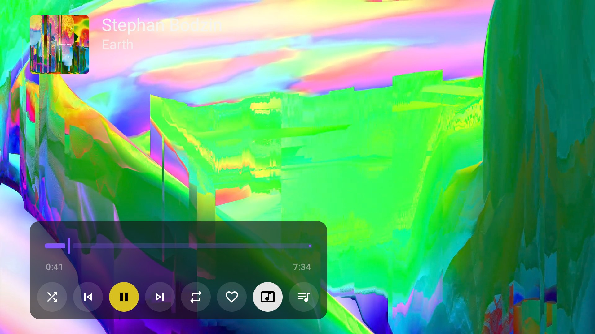
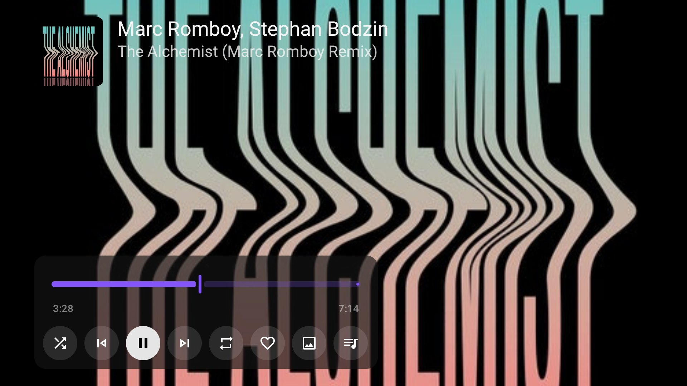
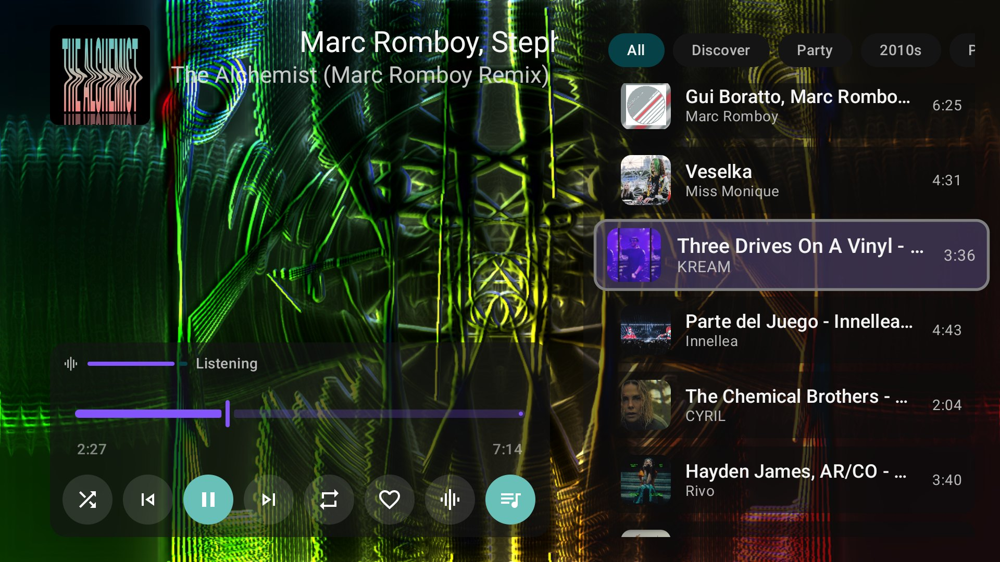

# Playback, queue and radio

## The full player

Selecting a track, **Play** or **Shuffle** opens the full player. The track's cover, artists and title sit in the upper left over the [visualizer](visualizer.md), the music video or the artwork. Press **OK** to show the controls.

| Control | What it does |
| --- | --- |
| Audio level (visualizer only) | **Listening**, **Very quiet** or **No sound**: what the visualizer currently hears |
| Seek bar | Elapsed and total time of the track |
| Shuffle, Previous, Play/pause, Next, Repeat | The usual queue controls |
| Heart | Like the track; music likes appear under **Liked songs** in Library |
| View button | Steps through the visualizer, the music video and the artwork |
| Queue | Opens the queue and radio presets beside the player |

The controls hide on their own after a few seconds. With them hidden, **Left** and **Right** step through visualizer presets. **Back** hides the controls, then leaves the player; the [mini player](getting-started.md#find-your-way-around) keeps showing the track elsewhere in the app. Music keeps playing in the background unless you turn off **Background Play** in [Settings → Playback](settings.md#playback).

## Visualizer, music video or artwork

The view button steps through three views while the audio carries on. Milkbeat remembers the view you leave it on for later tracks and later sessions.

=== "Visualizer"

    

    The default: [MilkDrop presets](visualizer.md) that react to the track you hear.

=== "Music video"

    

    The matched YouTube video, picked for your TV: at most 1080p, in a codec the TV decodes in hardware. Art Tracks with static album artwork count as videos.

=== "Artwork"

    

    The track's cover fills the screen.

YouTube matching searches recorded videos for every track while you listen, whichever view you use, but the picture only loads when you select the video view. A confirmed YouTube match can offer video even for Spotify, SoundCloud or Beatport tracks. A track without a usable video skips from the visualizer straight to the artwork; with the video view chosen, such a track shows the visualizer instead. With visualizations turned off, the button moves between video and artwork. A video that cannot play falls back to audio with the visuals.

## The queue

Open the queue with the button at the end of the control row to see what is coming and jump to any track. Holding **Up** or **Down** scrolls repeatedly and accelerates through a long queue. **Back** closes the queue.

## Radio and its presets

Every queue continues as a radio once its own tracks run out:

- A streaming album, playlist or artist hands over to the mix of its first song. When the provider it came from has no radio, Milkbeat asks your audio providers in priority order.
- Spotify tracks use the radio of their matched YouTube recording. A [prepared private playlist](providers.md#prepare-private-playlists) instead gives YouTube the whole playlist as its autoplay context.
- Selecting a single track plays it and then its radio.
- [Local music](#local-music-and-radio) seeds the radio from its first song without leaving the local file.

All the presets YouTube Music offers for the current radio appear in one scrolling line pinned above the queue: **All**, **Discover**, **Popular**, **Deep cuts**, moods such as **Party** or **Pump-up**, and decades such as **2010s**. Press **Right** on a queue track to reach them, **Left** and **Right** to move along them, **OK** to switch, and **Down** to return to the track you left with the queue's scroll position kept.

Switching a preset replaces the upcoming radio suggestions while keeping the playing song, the original playlist or album and any tracks you added yourself. Later continuations stay in the chosen preset. Presets only appear when the provider supplies them for the current context; the queue keeps room for the focused row's border even when there are none. Radio suggestions are never written into a prepared private playlist, and artists you hide stay out of mixes.

## Local music and radio

Local and network-folder music always plays from its file. With an enabled YouTube Music plugin, Milkbeat matches the first queued local song's title, artists and duration in the background and uses that match only to seed YouTube Music radio. A local album, playlist or artist queue uses its first song; collection queues continue with suggestions when endless radio is on. Without the plugin, a connection or a confident match, the local queue still plays and earlier radio suggestions are cleared.

In the **Local library** tab, selecting a track on an artist, release, playlist, year, genre or label page plays that track followed by its radio; **Play** and **Shuffle** queue the whole collection. **Play folder** in Library → Folders queues the current folder.

## Queue preparation and matching

When a track from one catalog plays through another provider's audio, Milkbeat has to find the same recording there. It prepares the entire remaining queue one track at a time, in playback order, while music plays; jumping elsewhere gives the new position priority. Tracks with native audio IDs need no matching.

Matching checks recording identity: title, performers and any named remix or edit must agree. Remixer credits may appear in the title or the artist list. Full versions are preferred over mixed excerpts, and a longer recording is accepted without a duration cap when everything else agrees; shorter conflicting excerpts are rejected. Video-capable audio providers match against recorded videos for ordinary playback, queue preparation and playlist indexing. Successful matches are cached and reused; confirmed unmatched tracks can be removed from the future queue, while temporary failures stay retryable.

Preparation reduces the work at each transition but cannot guarantee gapless playback under every network, format or provider condition.

## Buffering and recovery

Streamed music loads well ahead of the playing position: Milkbeat keeps loading until about 16 MB is buffered (roughly 13 minutes of typical audio, usually the whole song) and loads more once less than 30 seconds remain. A music video's picture shares that buffer, and a slow network or low memory keeps it shorter. If a stream fails, Milkbeat asks the audio provider for a fresh link to the same recording and resumes where it stopped.

If normal decoded TV audio (PCM) stops advancing for about five seconds while the player still reports playback, Milkbeat freezes the displayed progress and reconnects the output from the last position where audio was advancing, keeping the same track and queue. It tries twice before leaving the track paused with **Audio output stopped. Press Play to retry.** Pause, seeking, choosing another track or Stop cancels a pending restart. Quiet passages do not trigger recovery, though a recovery may repeat a short stretch of the song. Hardware-offloaded audio and encoded HDMI passthrough are outside this check.

## Encrypted provider audio

Compatible plugins can supply Widevine-protected audio through the device's DRM implementation. Milkbeat fetches licenses separately from the audio and only from destinations the plugin is allowed to reach. Availability depends on the account, the recording and the device. SoundCloud previews are never treated as full tracks. The offline downloader supports clear progressive audio only; HLS and DRM audio cannot be downloaded.

The [video-matching preview](preview-testing.md) runs beside the stable app for testing upcoming playback changes.
