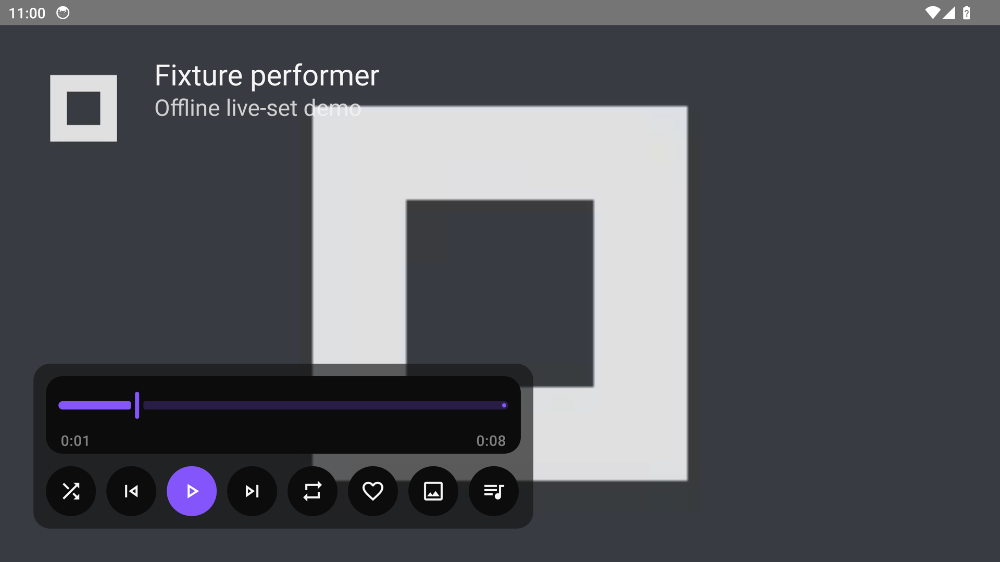
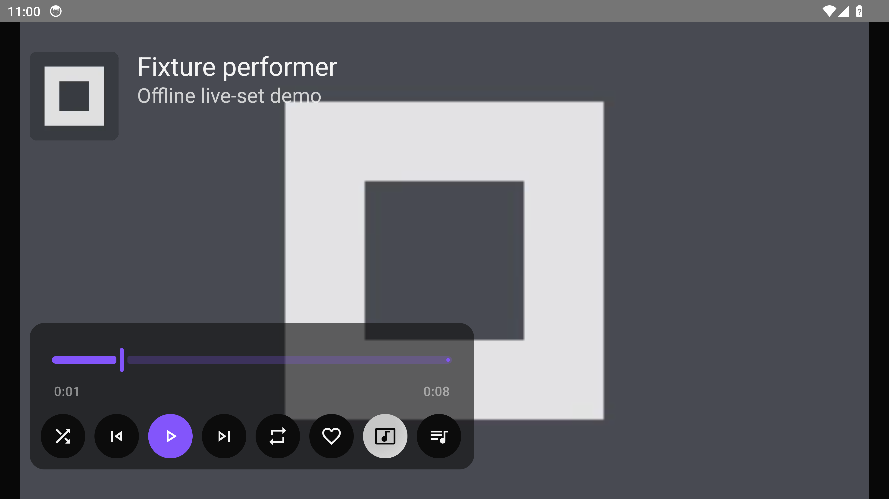
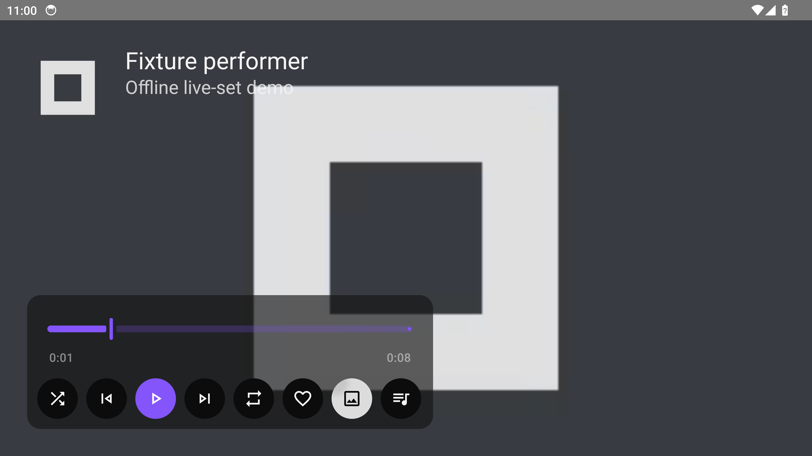

# Video matching preview

Install the prerelease APK named **Milkbeat Preview**. It uses a separate app ID and keeps its own settings, plugins and account sessions. Open that launcher entry to test; your stable Milkbeat app remains available. Stable downloader codes and automatic updates keep their stable packages;
Preview packages are published only for the separate Preview installation. Updated Preview
builds exclude stable-publication update checks and keep their pinned test packages. Older
archived Preview APKs retain their previous update behavior: turn off **Settings → Plugins →
Update plugins automatically** and avoid **Update all plugins** when reproducing those tests.
Install a new Preview build or use its documented code to test a newer preview package.

## Set up

1. Install the Preview APK from the linked GitHub prerelease.
2. In **Milkbeat Preview**, install the preview YouTube Music plugin using downloader code **494**. This feature requires YouTube Music **0.2.9-preview.1** together with the preview app. Preview downloader codes use its bundled catalog, so code 494 installs this test version even while stable publishes another version.
3. Install SoundCloud using **089** and sign in with its TV code if you want personalized Home and Library. YouTube sign-in is optional for matching and playback.
4. Put YouTube Music first under Audio in **Settings > Plugins**. There is no metadata provider to select: SoundCloud and YouTube Music each get their own tab in the sidebar.

## YouTube Video plugin

The Preview app offers the prerelease **YouTube Video** (**0.1.0-preview.6**), installed with downloader code **304**. This code exists only in the Preview app's bundled catalog; stable Milkbeat installs the released YouTube Video with code **932** instead. Like YouTube Music it provides metadata, audio and video, and it browses YouTube's TV Music feeds.

Earlier code **744** remains pinned to preview 4. New Preview builds include code **304** for preview 6; if your installed build lacks it, update the Preview app first. Preview 6 adds the exact Google activation destinations used by TV code sign-in.

1. In **Milkbeat Preview**, open **Settings > Plugins**, enter **304** and confirm the install.
2. Optionally select YouTube Video and choose **Sign in with a TV code** for personalized Home and Library; it also works signed out.
3. Under **Audio** and **Video**, choose it where you want it to supply playback.

YouTube Video shares the **YouTube** tab in the sidebar with YouTube Music; the tab carries that name whichever plugin provides it. With both installed, the tab shows YouTube Music's catalog and YouTube Video's catalog stays hidden, also in Search and Library. To test YouTube Video's catalog, disable or remove YouTube Music; the same tab then shows YouTube Video.

## Check playback

- Play a recorded live set or regular track. Video matching should run while playback remains audio-only in Visualizer or Artwork view.
- Open Now Playing controls. Use the view button after the heart to choose Video when a match is available. Art Tracks with static artwork count as video choices.
- Switching views should retain the recording and playback position. Hiding the player or returning to artwork should stop video rendering.
- A missing or unsupported picture should retain audio playback through the existing fallback. Matching should reject a different performer, event, year, creative version or short excerpt.

The live guest probes found Fideles at CRSSD Fall 2023 and Agents Of Time at Hï Ibiza 2024 with nearly identical recording lengths and available H.264 1080p pictures. These probes validate matching/format availability; confirm actual playback on your TV.

Report the track title, chosen view, preferred audio provider, what happened and the Preview app/plugin versions. The preview uses a separate installation, so setup and sign-in are not copied from stable Milkbeat.

## Controlled playback examples

These Android 14 emulator screenshots use a generated static frame and silent local audio, with synthetic provider metadata. They show the actual TV controls and Media3 playback surface; they are not live-provider or account screenshots.

Audio-only before Video is selected:

After selecting Video, the static Art Track frame renders at the same playback position:

An unavailable picture returns to artwork while audio resumes from the same position:

