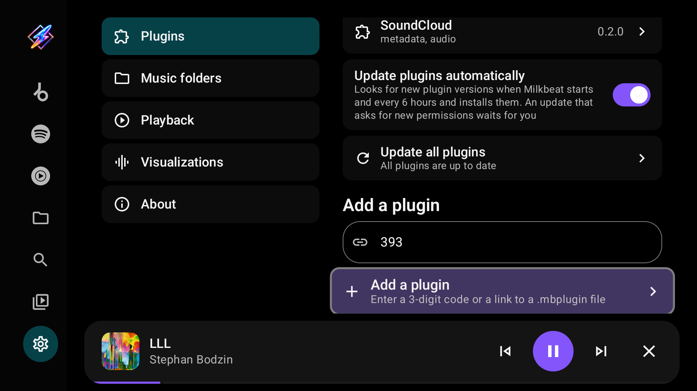
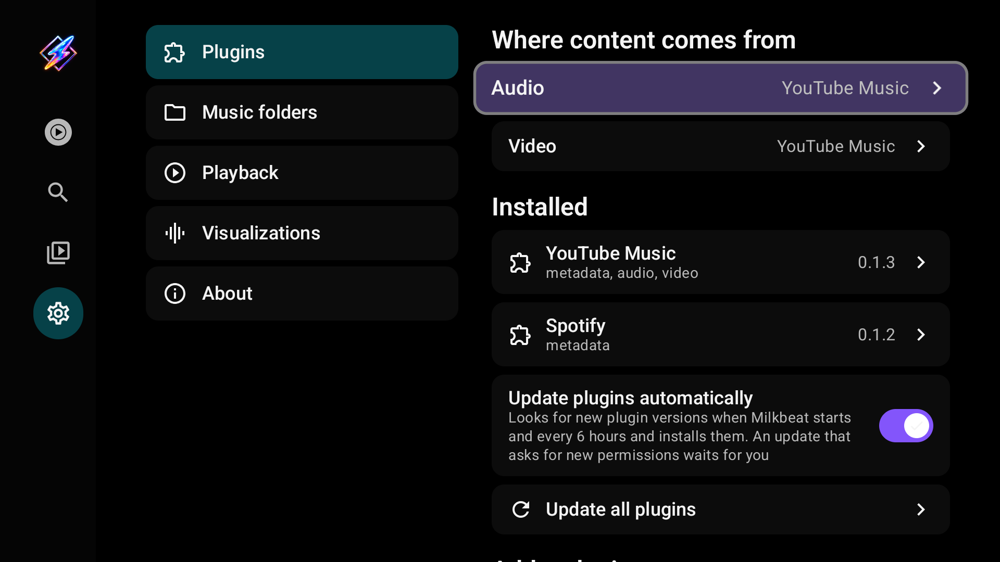
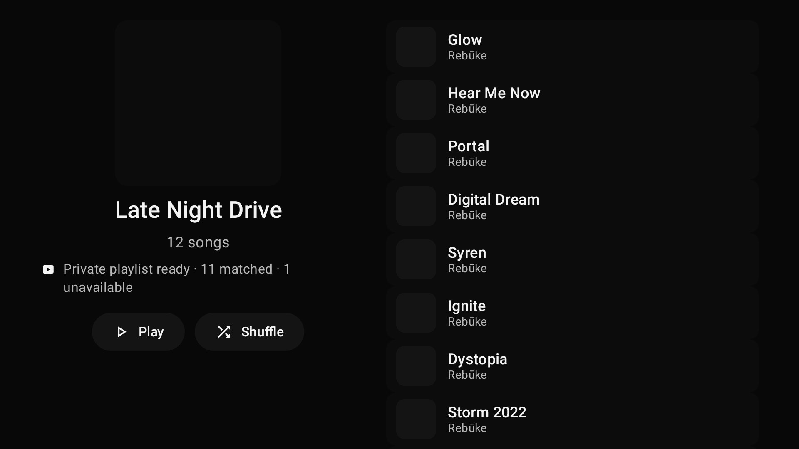
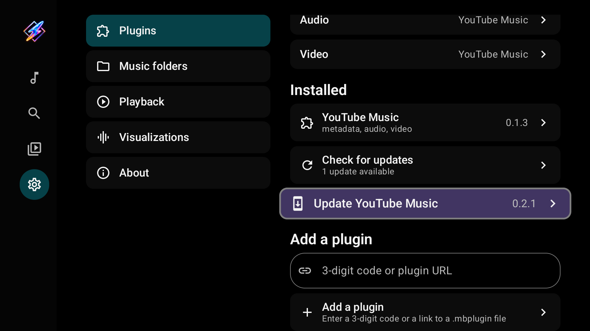
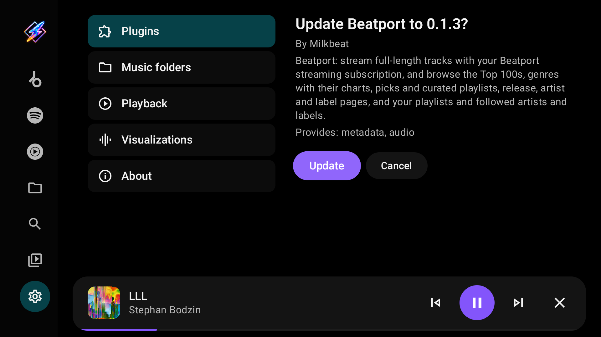
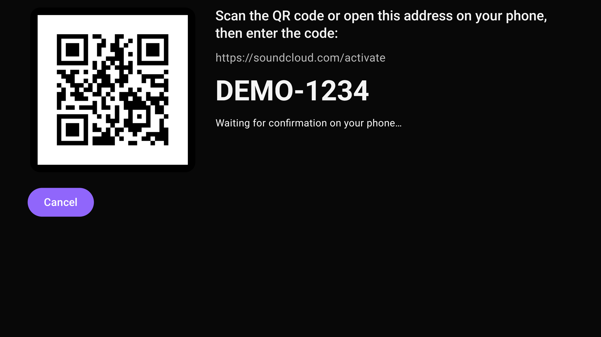

# Providers and phone sign-in

[User guide](index.md)

## Understand the three roles

| Role | Controls |
| --- | --- |
| Metadata | Music Home, music search, artist/album/playlist pages and account libraries |
| Audio | Streams and matches for tracks described by metadata providers |
| Video | Video search and playback |

A plugin can provide more than one role. Local and network folder playback (SMB, WebDAV, SFTP and NFS) are built in and need none of these roles.

## Install a third-party plugin

1. Open Settings → Plugins.
2. Enter a registered 3-digit third-party plugin code or a third-party plugin download URL. Plugin packages are distributed separately from Milkbeat app releases.
3. Select **Add a plugin**.
4. Review its author, roles and requested access, then install it.

### Download codes

<!-- plugin-codes:user-guide -->
| Code | Plugin |
| --- | --- |
| **393** | Beatport |
| **981** | Spotify |
| **494** | YouTube Music |
| **089** | SoundCloud |
<!-- /plugin-codes -->

Codes need a Milkbeat build with download-code support; earlier releases accept URLs. Stable builds prefer the publisher's live catalog and use the bundled catalog offline. The separate Preview app pins codes to its test catalog. An unknown code reports an error; try its full URL or update the app.

Full URLs still work, including supported Buzzheavier file pages. An address without a scheme defaults to HTTPS. Milkbeat resolves Buzzheavier's download link, downloads the package, and verifies its signature before offering installation.

These two captures show the code-enabled development build. Stable builds can resolve newly published codes without an app update. Preview codes are delivered with the preview APK; entering a code does not update an already-installed plugin.

| Plugin | Metadata | Audio | Video |
| --- | --- | --- | --- |
| YouTube Music | Home, Search, artists, albums, playlists, library | Streams, cross-provider matching and radio | YouTube videos, channels and playlists |
| Spotify | Home, Search, artists, albums, playlists, library | **None — select a separate audio provider** | None |
| Beatport | Catalog, genres, charts, artists, labels, library | Full streams with a streaming subscription | None |
| SoundCloud | Discover, Stream, Search, Artists, albums, playlists, Liked Songs and history | Available full tracks, matching and stations | None |

## Sign-in and account requirements

- **YouTube Music:** sign-in is optional. Signing in changes Home into a personalized feed based on the account and makes its library available. Free YouTube accounts are supported; Premium is not required for this personalization.
- **Spotify:** a metadata provider with **no audio source**. It can technically access catalog metadata without sign-in, but its practical value is your personalized feed, playlists, Liked songs and library after signing in. Select a separate audio provider for playback.
- **Beatport:** sign in for catalog metadata and your library. Beatport's own full-length audio
  requires an active streaming subscription. You can instead select SoundCloud or YouTube Music
  for audio and let Milkbeat match the available recording. Catalog access and matching still
  depend on the account and service; a free account is not a guarantee of a particular match.
- **SoundCloud:** sign in for personalized Home, playlists, Liked Songs, history and Artists
  (the accounts SoundCloud calls Following). Public search and catalog pages can work anonymously.
  Full-track availability and quality depend on the recording and consumer subscription;
  Artist Pro does not grant Go+ listening rights. Preview-only or restricted recordings can still
  appear as metadata, but cannot supply full-track audio. Enable another audio provider as a fallback.
  Install a Milkbeat build with plugin API 5 support before installing SoundCloud plugin 0.2.0.
  TV-paired accounts currently play clear HLS streams only. Protected-only recordings cannot play
  with this session because the mobile license exchange remains unverified. Existing web sessions
  retain their Widevine playback path, subject to device support and account license access.
  Playback from a TV-paired SoundCloud account does not currently report listens to SoundCloud.

## Music tabs and video

There is no metadata provider to choose. Every installed, enabled catalog plugin you are signed in to gets its own tab in the sidebar, marked with the service's logo; YouTube Music's tab appears without sign-in. Signing out of a provider, or disabling it, removes its tab. Under **Video**, choose the video provider.

## Set audio priority

Under **Audio**, enable the providers you want to use. Select **Move earlier** or **Move later** to change their order, then **Done**.

For example, YouTube Music first and Beatport second means Milkbeat tries YouTube first. If it cannot find or play a recording, it tries Beatport. Availability depends on each catalog, account and subscription. YouTube matching searches recorded videos, including static Art Tracks and archived live sets, regardless of whether you choose the visualizer, artwork or video view. It still checks recording identity; an unrelated performance, cover or excerpt is rejected. The picture loads only when you select Video in Now Playing.

## Spotify with YouTube audio

Select Spotify for metadata and YouTube Music for audio. Spotify supplies the catalog and playlists; YouTube supplies a matched recording. The playing recording can differ from the catalog entry. Supported YouTube audio radio can continue with the matched track's mix.

## Prepare private playlists

### Why prepare a YouTube playlist?

The purpose is music discovery: give YouTube's radio and autoplay a reference for your whole Spotify playlist, so the continuation can follow the collection's sound rather than just its opening song.

| Setting | What YouTube receives for the continuation |
| --- | --- |
| **Off** | The matched YouTube ID of the playlist's first song. Milkbeat asks YouTube for that song's radio, then appends suggestions after your Spotify queue. |
| **On** | A native YouTube Music playlist containing the matched Spotify songs. Milkbeat plays that copy and requests autoplay in the playlist's context, giving YouTube the complete collection as a reference. |

YouTube supplies the recommendations in both cases. Its system uses several signals, including playlists; the result is generated by YouTube, not a local shuffle or a radio model trained by Milkbeat. [YouTube's playlist explanation](https://support.google.com/youtube/answer/7665542?hl=en).

Preparing the whole playlist also gives Milkbeat YouTube IDs for every matched song, so it can exclude songs already in the playlist from the radio continuation and remove repeated suggestions. This helps avoid hearing playlist tracks again as the mix begins. Radio still stays outside the private copy: choosing a preset such as **Popular**, **Discover** or **Deep cuts** changes future recommendations, not either playlist's contents.

Whatever you play continues as a radio, and every radio offers all the presets YouTube Music has for it, pinned in one scrolling line at the top of the queue. Press Right on a queue track to reach them, Left and Right to move along them, and Down to return to the track you left.

### Enable preparation

This option is **off by default** and requires Milkbeat 0.9.0 or later and compatible Spotify and YouTube Music plugins, with both enabled and signed in. Both plugins need playlist-preparation support (Spotify and YouTube Music version 0.2.1 or later). Older plugins can still provide their existing playback features, but will not show this option.

1. Open **Settings → Plugins → Spotify**.
2. Enable **Prepare private playlists in YouTube Music**.
3. Let your own Spotify playlists and Liked Songs prepare in the background. Other playlists, including generated mixes, begin preparing when you open them.
4. Select Play or a track. If syncing is still in progress, Milkbeat shows a short message that playback will start when the playlist is ready. The page shows percentage progress through matching, writing and verification, plus unavailable tracks. Once the copy is ready, a small YouTube mark appears beside **Private playlist ready**: playing the playlist then uses its private YouTube Music copy. Select **Retry preparation** if it fails.

   

Milkbeat creates private YouTube copies with the source playlist cover, resolves the source songs, then adds the matched songs together and verifies the copy. With a Milkbeat build that supports batch matching and YouTube Music 0.2.3 or later, matching runs in bounded parallel batches while the empty copy is prepared. Recording title, performer and named remix/edit checks reject conflicting candidates. Remixer credits can appear in the title or artist list, and explicitly listed members can identify a collective artist credit regardless of their order. Longer recordings have no duration cap or required full/extended label when the recording title, performers and named remix/edit agree; full versions are preferred over mixed excerpts. Shorter conflicting excerpts are rejected. Additional searches run only when the first search has no acceptable match. Older compatible plugins retain sequential matching. Copies refresh from Spotify in one direction and preserve track order and duplicate occurrences. Confidently unmatched songs are left out of the copy; temporary connection failures remain retryable. Spotify's playlists are not edited. Background refresh is scheduled approximately every six hours, subject to network and device constraints; opening a ready playlist reuses its saved preparation for up to six hours, without fetching the source again, re-matching tracks or rewriting the YouTube copy. Older preparations, changed titles or covers, and unfinished preparations are checked again on open.

Managed copies are reused after restarting Milkbeat. When Spotify changes, Milkbeat updates the existing copy's songs and order instead of creating another same-name playlist. If a managed copy was deleted, preparation can create a replacement. Albums are not mirrored.

Only the source playlist's matched songs belong in the private copy. YouTube's autoplay and radio suggestions are added to Milkbeat's playback queue, outside that copy. Changing a radio mode does not change either playlist.

Prepared playback uses known YouTube IDs and native collection autoplay, while displaying Spotify's song metadata and catalog cover. [Artwork view](playback.md#visualizer-music-video-or-artwork)
can show the accepted audio provider's playback thumbnail, falling back to that catalog cover. Choosing a missing song starts at the next available match. Initial preparation can delay playback, especially for large playlists. Play shares any preparation already running on the page. Recently verified copies and their matches are reused across restarts. Previously unavailable songs are retried once when the matching rules change, so an old rejection does not hide a newly valid match. Interrupted work resumes from checkpoints.

Disable the option to return to normal matching and radio based on the first playing song. Existing private copies remain in your YouTube library. While Spotify is selected for metadata, Library hides managed copies that duplicate their source playlists.

## Sign in on your phone

### YouTube Video preview

**YouTube Video** is a separate provider for the API 6 Preview app. It keeps its own account and
can be installed alongside **YouTube Music**. Select it for metadata to browse SmartTube's Music
section: recommended music, charts, new videos and the other rows supplied for your region or
account. TV-code sign-in adds Liked Music before those rows. Show More includes the full original
row and its continuation; playlist and mix pages retain their track order.

In the installed provider's details, choose **Sign in with a TV code**. Scan the QR link or open
the displayed YouTube address, then approve the code in your Google account. Keep the TV screen
open until pairing completes. Cancelled, declined or expired attempts need a fresh code. Guest
browsing and playback do not require sign-in. After signing out or changing accounts, refresh
open catalog pages; old account or guest-session page tokens are rejected.

YouTube Video searches regular YouTube recordings for music playback, including uploads from
unofficial channels. Audio starts without picture; choose Video in Now Playing to show the
accepted recording's picture. Artwork view uses its highest available thumbnail, with the
catalog cover as a fallback. Switching views retains the original catalog title, artist and
recording identity. Resolution depends on the recording and the TV's supported codecs.

The paired host handles SABR streaming through Media3. SABR streams are currently available
for playback, not offline downloads. An audio-only live source needs an independent audio
rendition; a stream with only combined audio/video cannot silently fetch picture bytes in
audio-only mode. This preview's provider package is distributed separately from the app;
use the paired test package supplied with the preview build.

### Other provider sign-ins

Open the installed plugin's details and choose its sign-in method.

**SoundCloud TV pairing:** scan the activation QR code or open the displayed address on your phone,
then enter the short code and approve sign-in. Your phone does not need to share the TV’s network.
Leave this screen open while approval completes. Leaving it or sending Milkbeat to the background
cancels the pending attempt; request a fresh code when you return. Expired or declined codes can
be retried. The plugin checks that the completed session can fetch the account and Home before
accepting sign-in.

**Web sign-ins:** scan the TV's QR code with a phone on the same network. The phone viewer streams the actual provider page on the TV: use touch and typing to complete sign-in and provider verification.

The viewer handles sign-in. Music browsing and playback remain in Milkbeat's TV interface. When a provider reports that a sign-in expired, Milkbeat immediately asks the plugin again in the background whether the account still signs in, retrying temporary connection failures, and restores it without any action when it does; private playlist preparation then resumes on its own. With YouTube Music 0.2.4 or later, a single refused request, such as a saved playlist YouTube will not open, no longer signs the account out. An account the provider confirms expired needs sign-in again; local folders remain usable.

## Index playlists

In a signed-in metadata plugin's details, select **Index playlists**. Tracks and Liked songs are matched against audio providers in priority order. Completed matches are reused during playback and kept if indexing is cancelled. Re-index after changing the account, plugin or audio-provider order.

## Update or remove a plugin

Select **Check for updates** under the installed plugins. Milkbeat asks the plugin publisher for the current version of each installed plugin and lists every newer one by the same author as **Update** with its version; select one to download it. Milkbeat presents the update for review; it must have the same signing author and cannot be older than the installed version. Entering a plugin's download code or link again still works too. Plugin updates are separate from app updates.

Select an installed plugin to inspect its account, sign out or remove it. Removing a plugin does not remove local music sources.

## Third-party plugin downloads

Third-party plugins are optional downloads and are not included in Milkbeat app releases. Install them through the codes above or a plugin download URL. The original codes **102** (Beatport), **772** (Spotify) and **416** (YouTube Music) remain supported.

### SoundCloud TV pairing

Choose **Sign in with a TV code**, scan the QR link or open the displayed address on a phone or computer, sign in to SoundCloud and approve the code. Keep the TV screen open while it waits for confirmation. Back/Cancel or leaving the screen stops the attempt; request a new code when it expires. The plugin accepts the account only after its mobile account and Home requests succeed.

The image uses a fake code; enter the code shown on the TV. Pairing requires a compatible plugin API 5 build and the updated SoundCloud plugin. Existing web-cookie accounts can continue while accepted by SoundCloud; when reauthentication is needed, pair again. TV sessions do not submit unverified listening-history telemetry.
