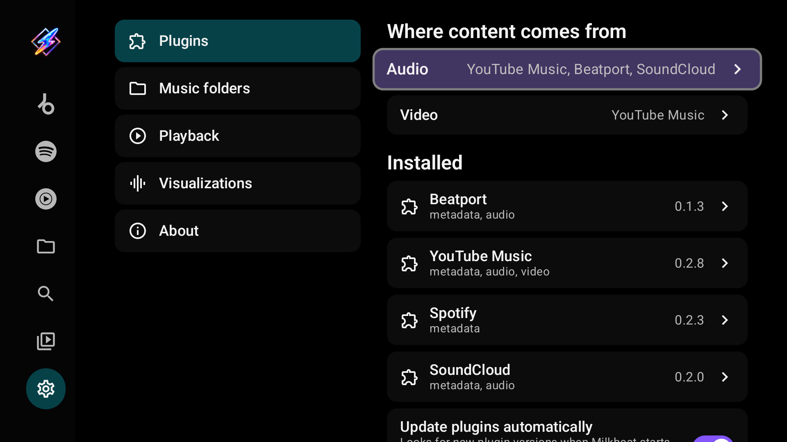
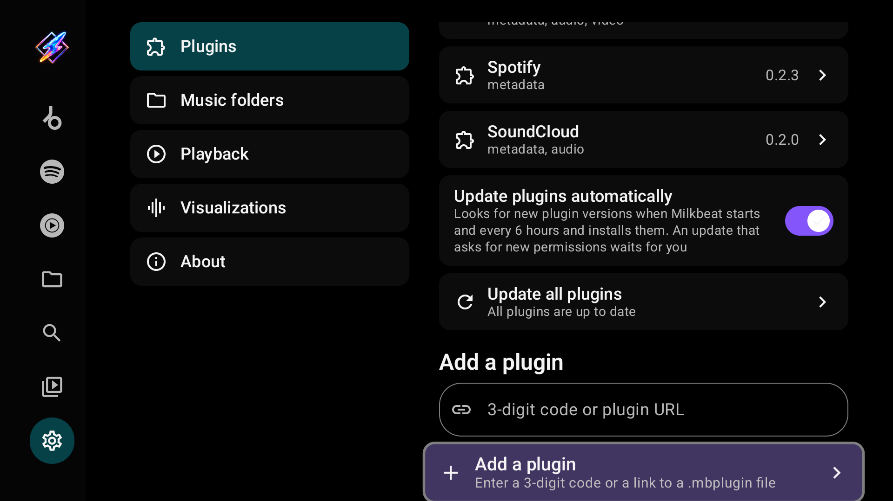
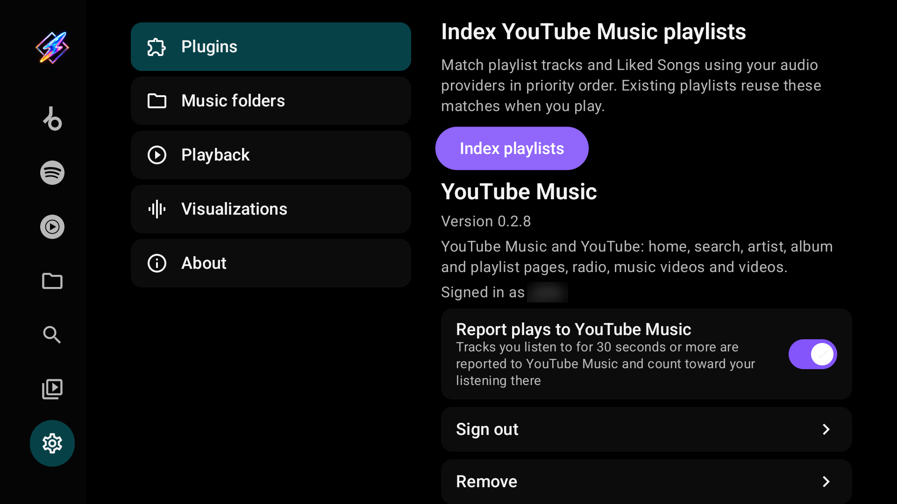
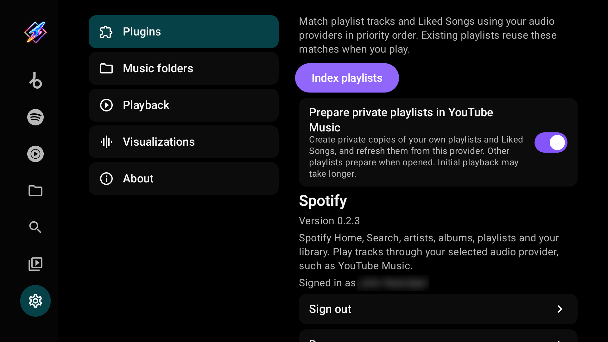
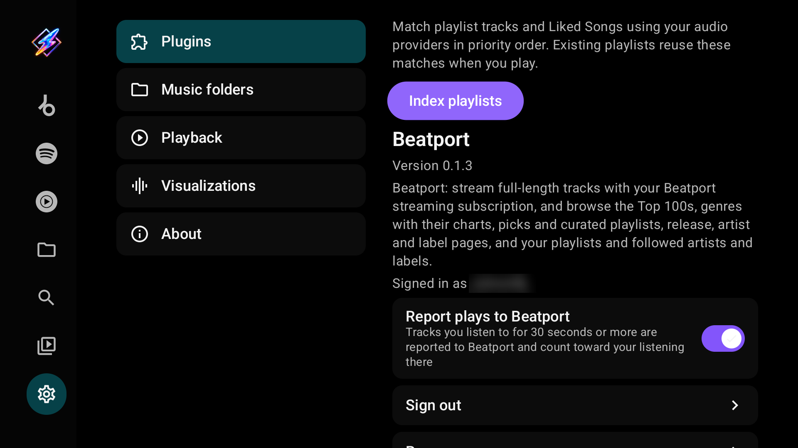
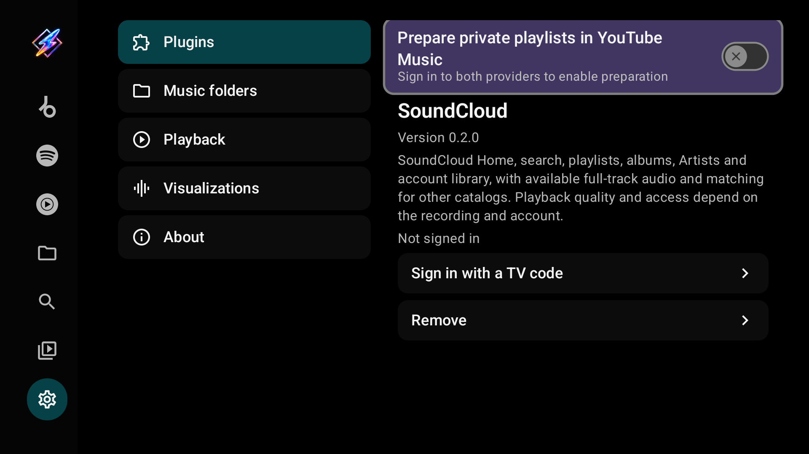
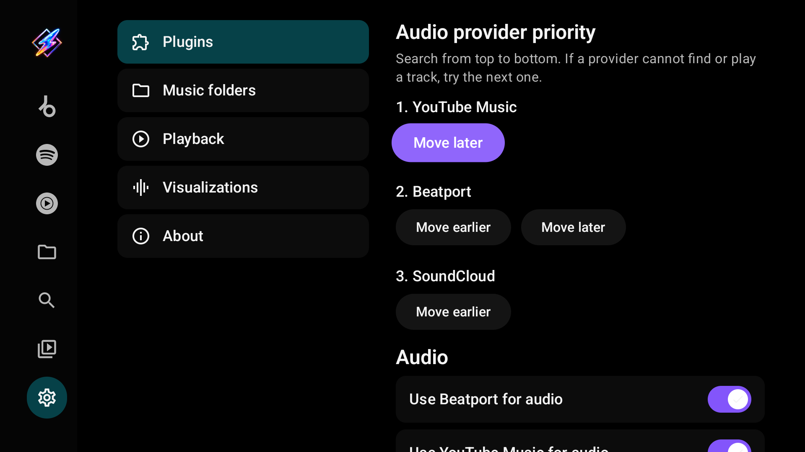
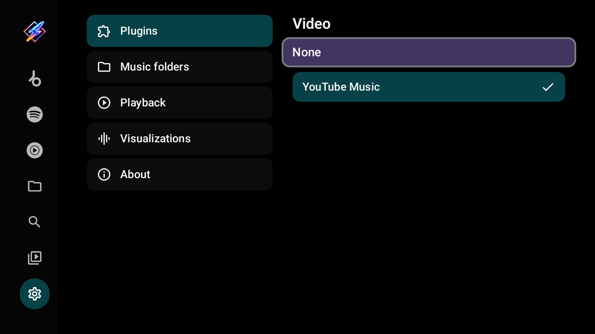
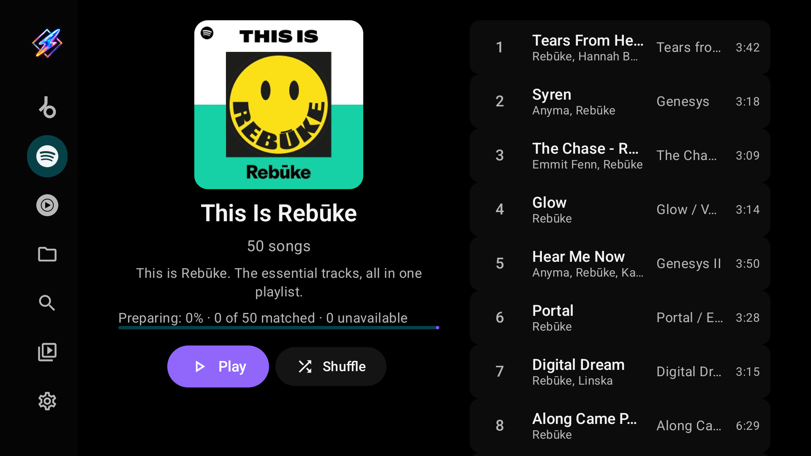
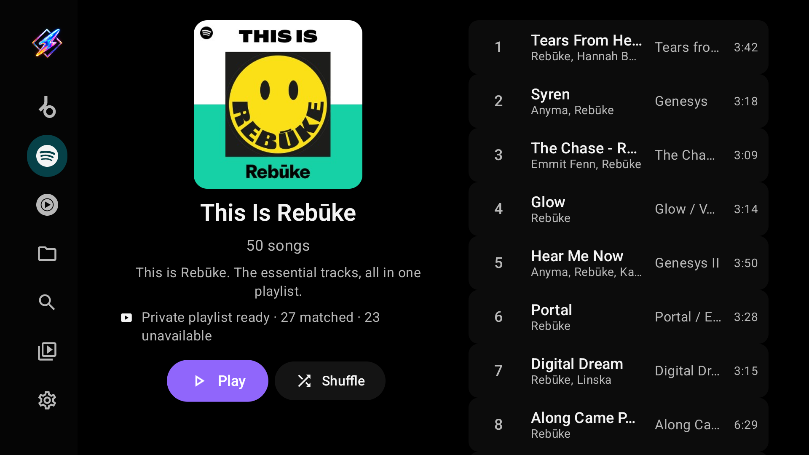

# Providers and sign-in

Streaming catalogs come from optional, separately distributed **plugins**. Local and network folders are built in and need none. A plugin can offer any mix of three capabilities, shown under its name in Settings → Plugins:

| Capability | What it supplies |
| --- | --- |
| **metadata** | A music tab with Home, Search, artist, album and playlist pages, and the account's library |
| **audio** | Playable streams, including matches for tracks from another provider's catalog |
| **video** | Video search and playback, and music videos in now playing |

There is no metadata provider to choose: every installed, enabled catalog you can use gets its own [music tab](library.md#a-tab-per-music-service). You only choose the order of audio providers and which plugin supplies video.

## The available plugins

| Plugin | Code | Catalog | Audio | Video |
| --- | --- | --- | --- | --- |
| YouTube Music | **494** | Home, Search, artists, albums, playlists, library | Streams, cross-provider matching and radio | YouTube videos, channels and playlists |
| Spotify | **981** | Home, Search, artists, albums, playlists, library | **None: use another audio provider** | — |
| Beatport | **393** | Catalog, genres, charts, artists, labels, library | Full streams with a streaming subscription | — |
| SoundCloud | **089** | Discover, Stream, Search, Artists, albums, playlists, Liked Songs, history | Available full tracks, matching and stations | — |

Capabilities depend on the installed plugin version, the account and its subscription. The separate [Preview app](preview-testing.md#youtube-video-plugin) also offers **YouTube Video** (code **744**, Preview only), which shares the YouTube tab with YouTube Music: with both installed the tab shows YouTube Music's catalog, and YouTube Video's catalog appears, also without sign-in, when it is the only one.

## Install a plugin

1. Open **Settings → Plugins** and scroll to **Add a plugin**.
2. Enter a registered three-digit code, or a plugin download URL (a `.mbplugin` file or a supported Buzzheavier file page; an address without a scheme defaults to HTTPS).
3. Select **Add a plugin**.
4. Review the plugin's author, description, capabilities and requested access, then select **Install** (or **Update** when that plugin is already installed). **Cancel** leaves everything as it was.

### Download codes

<!-- plugin-codes:user-guide -->
| Code | Plugin |
| --- | --- |
| **393** | Beatport |
| **981** | Spotify |
| **494** | YouTube Music |
| **089** | SoundCloud |
<!-- /plugin-codes -->

Stable builds prefer the publisher's live catalog and fall back to the bundled one offline, so newly published codes work without an app update. The separate [Preview app](preview-testing.md) pins its codes to its own test catalog. The original codes **102** (Beatport), **772** (Spotify) and **416** (YouTube Music) still work. An unknown code reports an error; try the plugin's full URL or update Milkbeat.

Milkbeat verifies a plugin's signature before offering installation. Buzzheavier sometimes asks to check the download in a browser; Milkbeat continues once the page lets it through.

## Keep plugins up to date

| Control | What it does |
| --- | --- |
| **Update plugins automatically** | On by default. Looks for new plugin versions when Milkbeat starts and every 6 hours and installs them. An update that asks for new permissions waits for your review |
| **Update all plugins** | Checks now and installs every available update. It reads *All plugins are up to date* when there is nothing to install, and lists any update that needs your review as **Update** *plugin* |

An update must come from the same signing author and cannot be older than the installed version. When updates were installed or need review, Milkbeat shows a short notice; reviews wait in Settings → Plugins. Entering a plugin's code or link again still works too. Plugin updates are separate from [app updates](settings.md#about).

## Plugin details

Select an installed plugin to see its version, description and account, and to sign in or out, report plays, index playlists or remove it. Removing a plugin never removes local music sources. Account names are blurred in these captures.

=== "YouTube Music"

    

=== "Spotify"

    

=== "Beatport"

    

=== "SoundCloud"

    

| Item | What it does |
| --- | --- |
| **Index playlists** | Matches the account's playlist tracks and Liked Songs against your audio providers in priority order, so playback can reuse the matches |
| **Prepare private playlists in YouTube Music** | Spotify and YouTube Music: see [below](#prepare-private-playlists). Needs both providers signed in |
| **Report plays to** *provider* | Tracks you listen to for 30 seconds or more are reported to that provider and count toward your listening there |
| **Signed in as** / **Not signed in** | The account state. *Signed out: sign in again* means the provider confirmed the session expired |
| **Sign in** / **Sign out** | Starts the provider's [sign-in method](#sign-in) or forgets the session |
| **Remove** | Uninstalls the plugin and its tab |

Completed indexing matches are kept when you cancel. Index again after changing the account or the audio-provider order.

## Sign-in and account requirements

- **YouTube Music:** sign-in is optional. Signing in turns Home into a personalized feed and makes your library available. Free YouTube accounts are supported; Premium is not required for personalization.
- **Spotify:** a catalog with **no audio source**. Its value is your personalized feed, playlists, Liked Songs and library after signing in. Keep at least one audio provider enabled.
- **Beatport:** sign in for the catalog and your library. Beatport's own full-length audio needs an active streaming subscription; otherwise SoundCloud or YouTube Music can match the recording. A free account does not guarantee a match.
- **SoundCloud:** sign in for personalized Home, playlists, Liked Songs, history and Artists. Public search and catalog pages can work anonymously. Full-track availability depends on the recording and your listening subscription; Artist Pro does not grant Go+ listening rights. Preview-only or restricted recordings can appear but cannot supply full-track audio, so keep another audio provider as a fallback. SoundCloud plugin 0.2.0 needs a Milkbeat build with plugin API 5. TV-paired accounts currently play clear HLS streams only; protected-only recordings cannot play with this session, and plays from a TV-paired account are not reported to SoundCloud. Existing web sessions keep their Widevine playback path where the account and device allow it.

## Sign in

Open the installed plugin's details and choose its sign-in method.

**TV code pairing (SoundCloud):** select **Sign in with a TV code**, scan the QR code or open the displayed address on a phone or computer, sign in and approve the short code. The phone does not need to be on the TV's network. Keep the TV screen open while it waits: leaving it, pressing Back or sending Milkbeat to the background cancels the attempt, and an expired or declined code can be requested again. The plugin accepts the account only after its account and Home requests succeed.

**Web sign-in (other providers):** scan the TV's QR code with a phone on the same network. The [phone viewer](https://github.com/johnneerdael/Milkbeat/blob/main/docs/phone-sign-in-remote-view.md) streams the provider's real sign-in page from the TV; use touch and typing on the phone to complete sign-in and any verification. Browsing and playback stay in Milkbeat's TV interface.

When a provider reports an expired sign-in, Milkbeat asks the plugin again in the background, retrying temporary connection failures, and restores the account without any action when it still works; private playlist preparation then resumes on its own. With YouTube Music 0.2.4 or later, a single refused request no longer signs the account out. An account the provider confirms expired needs sign-in again; local folders keep working.

## Set audio priority

Under **Audio**, switch on the providers you want (**Use** *provider* **for audio**), use **Move earlier** and **Move later** to order them, then select **Done**. Milkbeat searches from top to bottom: if a provider cannot find or play a track, it tries the next one.

YouTube matching searches recorded videos, including static Art Tracks and archived live sets, whichever now-playing view you use. It checks recording identity, so an unrelated performance, cover, different remix or short excerpt is rejected, and full versions are preferred over mixed excerpts. The picture loads only when you choose [the video view](playback.md#visualizer-music-video-or-artwork).

Under **Video**, choose which plugin supplies videos, or **None**.

## Spotify with YouTube audio

Sign in to Spotify and keep YouTube Music enabled under Audio. Spotify supplies the catalog and playlists; YouTube supplies a matched recording, which can differ from the catalog entry. The queue then continues with the matched track's YouTube radio.

## Prepare private playlists

### Why prepare a YouTube playlist?

The purpose is music discovery: give YouTube's radio and autoplay a reference for your whole Spotify playlist, so the continuation can follow the collection's sound rather than just its opening song.

| Setting | What YouTube receives for the continuation |
| --- | --- |
| **Off** | The matched YouTube ID of the playlist's first song. Milkbeat asks YouTube for that song's radio, then appends suggestions after your Spotify queue. |
| **On** | A native YouTube Music playlist containing the matched Spotify songs. Milkbeat plays that copy and requests autoplay in the playlist's context, giving YouTube the complete collection as a reference. |

YouTube supplies the recommendations in both cases. Its system uses several signals, including playlists; the result is generated by YouTube, not a local shuffle or a radio model trained by Milkbeat. [YouTube's playlist explanation](https://support.google.com/youtube/answer/7665542?hl=en).

Preparing the whole playlist also gives Milkbeat YouTube IDs for every matched song, so it can exclude songs already in the playlist from the radio continuation and remove repeated suggestions. This helps avoid hearing playlist tracks again as the mix begins. Radio still stays outside the private copy: choosing a preset such as **Popular**, **Discover** or **Deep cuts** changes future recommendations, not either playlist's contents.

Whatever you play continues as a radio, and every radio offers all the presets YouTube Music has for it, pinned in one scrolling line at the top of the queue. Press Right on a queue track to reach them, Left and Right to move along them, and Down to return to the track you left.

### Enable preparation

This option is **off by default** and requires Milkbeat 0.9.0 or later and compatible Spotify and YouTube Music plugins, with both enabled and signed in. Both plugins need playlist-preparation support (Spotify and YouTube Music version 0.2.1 or later). Older plugins can still provide their existing playback features, but will not show this option.

1. Open **Settings → Plugins → Spotify**.
2. Enable **Prepare private playlists in YouTube Music**.
3. Let your own Spotify playlists and Liked Songs prepare in the background. Other playlists, including generated mixes, begin preparing when you open them.
4. Select Play or a track. If syncing is still in progress, Milkbeat shows a short message that playback will start when the playlist is ready. The page shows percentage progress through matching, writing and verification, plus unavailable tracks. Once the copy is ready, a small YouTube mark appears beside **Private playlist ready**: playing the playlist then uses its private YouTube Music copy. Select **Retry preparation** if it fails.

   

   
   
   

Milkbeat creates private YouTube copies with the source playlist cover, resolves the source songs, then adds the matched songs together and verifies the copy. With a Milkbeat build that supports batch matching and YouTube Music 0.2.3 or later, matching runs in bounded parallel batches while the empty copy is prepared. Recording title, performer and named remix/edit checks reject conflicting candidates. Remixer credits can appear in the title or artist list, and explicitly listed members can identify a collective artist credit regardless of their order. Longer recordings have no duration cap or required full/extended label when the recording title, performers and named remix/edit agree; full versions are preferred over mixed excerpts. Shorter conflicting excerpts are rejected. Additional searches run only when the first search has no acceptable match. Older compatible plugins retain sequential matching. Copies refresh from Spotify in one direction and preserve track order and duplicate occurrences. Confidently unmatched songs are left out of the copy; temporary connection failures remain retryable. Spotify's playlists are not edited. Background refresh is scheduled approximately every six hours, subject to network and device constraints; opening a ready playlist reuses its saved preparation for up to six hours, without fetching the source again, re-matching tracks or rewriting the YouTube copy. Older preparations, changed titles or covers, and unfinished preparations are checked again on open.

Managed copies are reused after restarting Milkbeat. When Spotify changes, Milkbeat updates the existing copy's songs and order instead of creating another same-name playlist. If a managed copy was deleted, preparation can create a replacement. Albums are not mirrored.

Only the source playlist's matched songs belong in the private copy. YouTube's autoplay and radio suggestions are added to Milkbeat's playback queue, outside that copy. Changing a radio mode does not change either playlist.

Prepared playback uses known YouTube IDs and native collection autoplay, while displaying Spotify's song metadata and artwork. Choosing a missing song starts at the next available match. Initial preparation can delay playback, especially for large playlists. Play shares any preparation already running on the page. Recently verified copies and their matches are reused across restarts. Previously unavailable songs are retried once when the matching rules change, so an old rejection does not hide a newly valid match. Interrupted work resumes from checkpoints.

Disable the option to return to normal matching and radio based on the first playing song. Existing private copies remain in your YouTube library. While Spotify is signed in, Library hides managed copies that duplicate their source playlists.
