# Settings reference

Settings has five categories on the left: **Plugins**, **Music folders**, **Playback**, **Visualizations** and **About**. Their controls are on the right. **Back** closes a page opened inside a category, such as audio priority, a plugin's details, an install review or a folder editor, and then leaves Settings; selecting the category again also returns to its first page. Pickers open as a side panel that **Back** closes, with the default for your device marked.

## Plugins

| Item | What it does |
| --- | --- |
| **Audio** | The providers that supply audio and the order Milkbeat tries them. [Set audio priority](providers.md#set-audio-priority) |
| **Video** | The plugin that supplies videos, or None |
| **Installed** | Each plugin with its capabilities (metadata, audio, video) and version. Select one for its [details](providers.md#plugin-details): account, sign-in, play reporting, playlist indexing, private playlists and Remove |
| **Update plugins automatically** | On by default: checks at start and every 6 hours and installs updates; updates asking for new permissions wait for review |
| **Update all plugins** | Checks and installs updates now. An update that needs a newer Milkbeat waits; in the GitHub build its row opens [About](#about) to update the app. [Updates that need a newer Milkbeat](providers.md#updates-that-need-a-newer-milkbeat) |
| **Add a plugin** | A three-digit code or plugin URL. [Install a plugin](providers.md#install-a-plugin) |

There is no Metadata option: each catalog you can use has its own [music tab](library.md#a-tab-per-music-service).

## Music folders

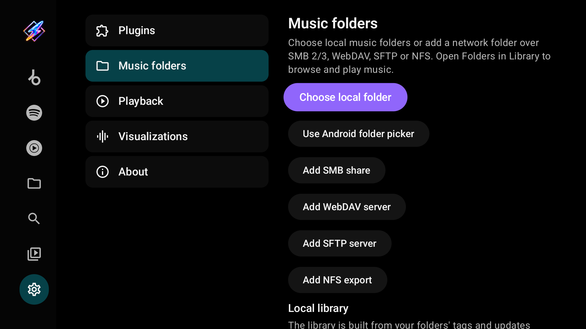

| Item | What it does |
| --- | --- |
| **Choose local folder** | Milkbeat's D-pad browser for the TV's storage and USB drives. Storage access is asked for only here |
| **Use Android folder picker** | The system picker, granting access to one folder only |
| **Add SMB share** / **WebDAV server** / **SFTP server** / **NFS export** | A network source; each has **Test access** and **Save** |
| **Local library** → **Rescan library** | Scans every source now; the index otherwise updates when sources change and at start when older than six hours |
| Saved sources | Each source with its type. Select one to edit it or **Remove folder** |

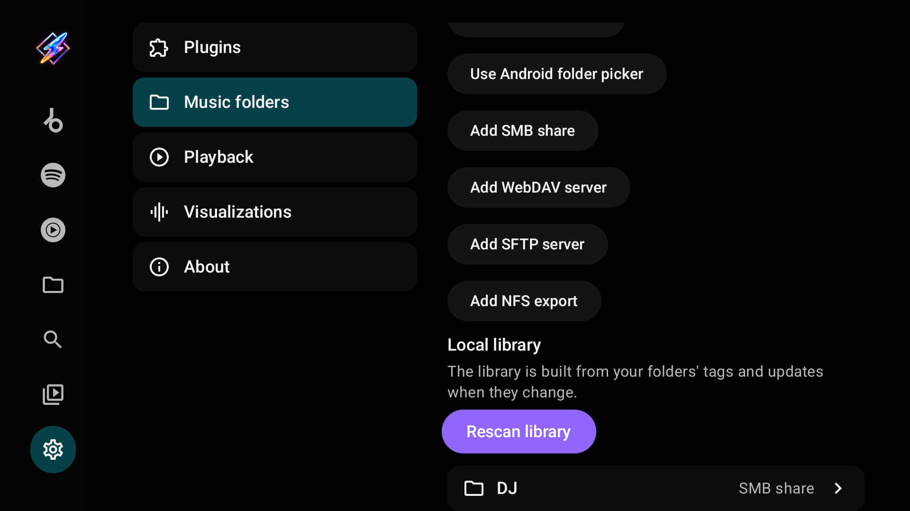

See [Local and network folders](folders.md) for every field and server requirement.

## Playback

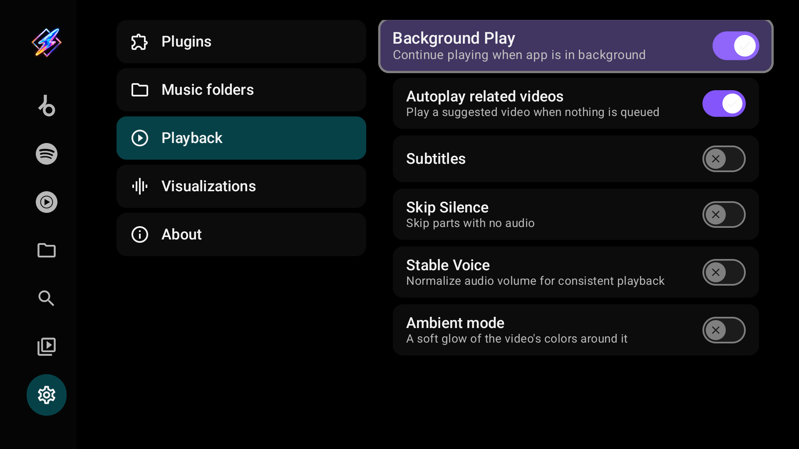

| Setting | What it does |
| --- | --- |
| **Background Play** | Keep playing when Milkbeat is in the background. On by default |
| **Autoplay related videos** | Play a suggested video when nothing is queued |
| **Subtitles** | Show subtitles on videos by default |
| **Skip Silence** | Skip parts with no audio |
| **Stable Voice** | Normalize audio volume for more consistent playback |
| **Ambient mode** | A soft glow of the video's colours around it |
| **Debug playback logging** | Write local actions, resolution, request timings and playback output events to Android logcat. Off by default; saved on this device only |

Video quality and codec are picked automatically for your TV and the available streams, and SponsorBlock is always on for supported videos; neither has a setting.

## Visualizations

The ProjectM TV engine's settings, applied to Milkbeat's own visualizer. Changes apply the next time now playing shows the visualizer. The [visualizer page](visualizer.md) explains what each one does, with links to ProjectM TV's in-depth guide.

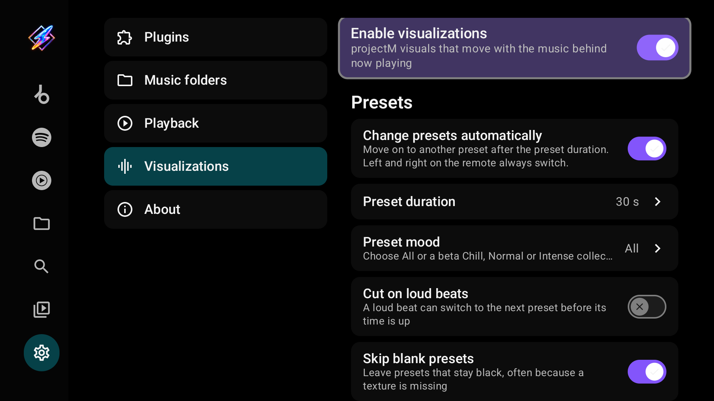

### Presets

| Setting | What it does | Default |
| --- | --- | --- |
| **Enable visualizations** | projectM visuals behind now playing | On with about 2 GB of RAM or more |
| **Change presets automatically** | Move on after the preset duration; Left and Right always switch | On |
| **Preset duration** | 10, 15, 20, 30, 45, 60 or 90 s | 30 s |
| **Preset mood** | All, or the beta Chill, Normal and Intense collections | All |
| **Cut on loud beats** | A loud beat can switch to the next preset early | Off |
| **Skip blank presets** | Leave presets that stay black, often because a texture is missing | On |
| **Skip slow presets** | Leave presets far below the frame rate even at the lowest resolution | On |
| **Reset skipped presets** | Shows how many presets were skipped; select to bring them back | — |

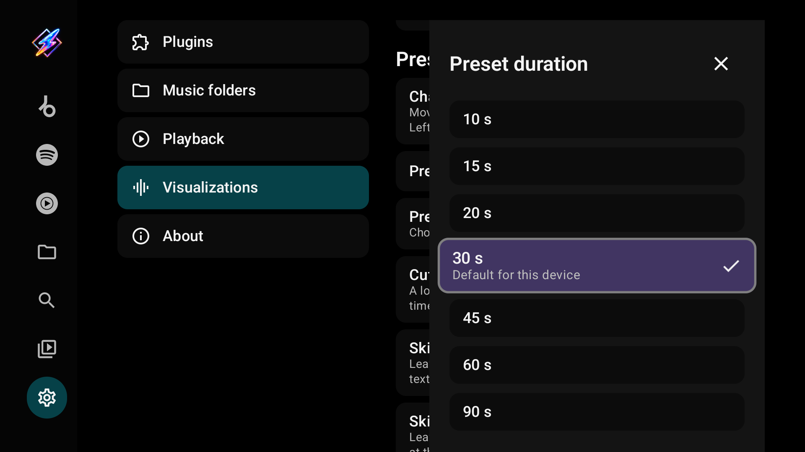

### Transitions and picture quality

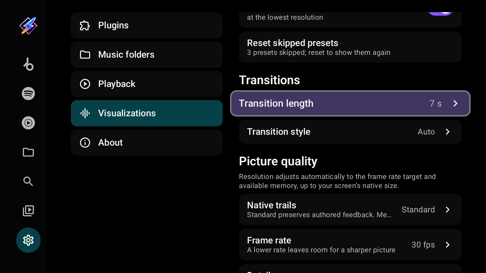

| Setting | What it does | Default |
| --- | --- | --- |
| **Transition length** | Instant to 10 s; two presets render during a blend | 7 s (2 s on low-RAM devices) |
| **Transition style** | **Auto** blends at a lower, adaptive resolution; **Lightweight** cuts and fades the old preset out on top; **Classic** is a full-resolution blend and costs the most | Auto |
| **Native trails** | **Standard** keeps authored feedback; **Medium** and **High** add trail detail above 1330p at extra GPU cost | Standard |
| **Frame rate** | The display rate divided by 1, 2 or 4, at least 24 fps. A lower rate leaves room for a sharper picture | 30 fps |
| **Detail** | Warp mesh from Minimal to Ultra: finer warps and zooms for more processor time | By device (Medium here) |
| **Show diagnostics** | Frame rate, render size, transition, audio level and preset in the playback controls | Off |

Resolution is always automatic: it follows the frame-rate target and live memory headroom up to the screen's native size, including 4K. Previously saved fixed resolutions and memory toggles no longer apply.

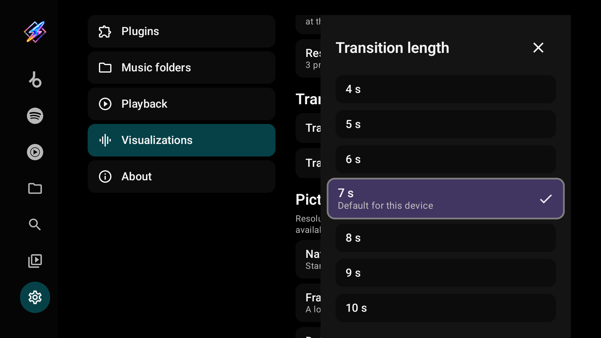
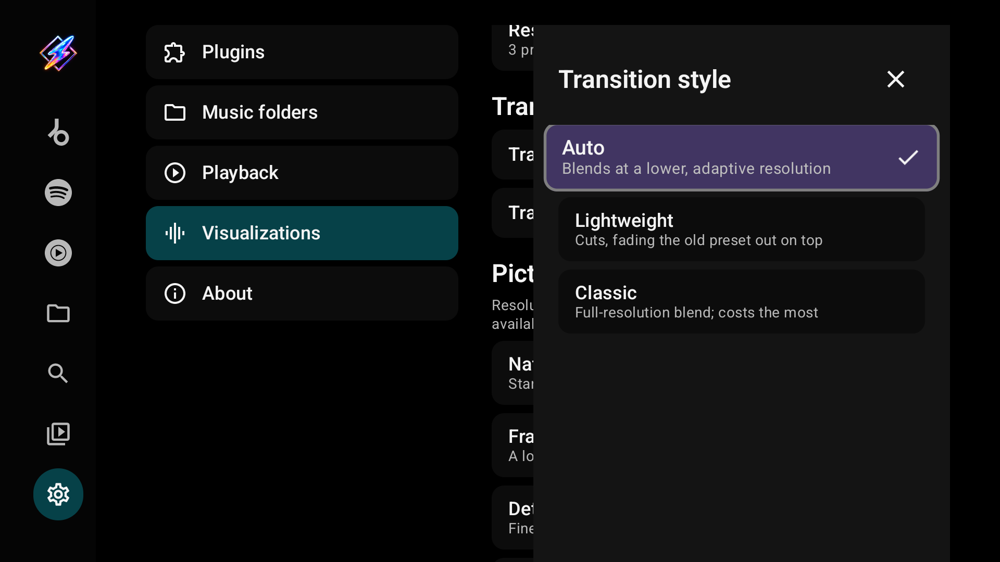

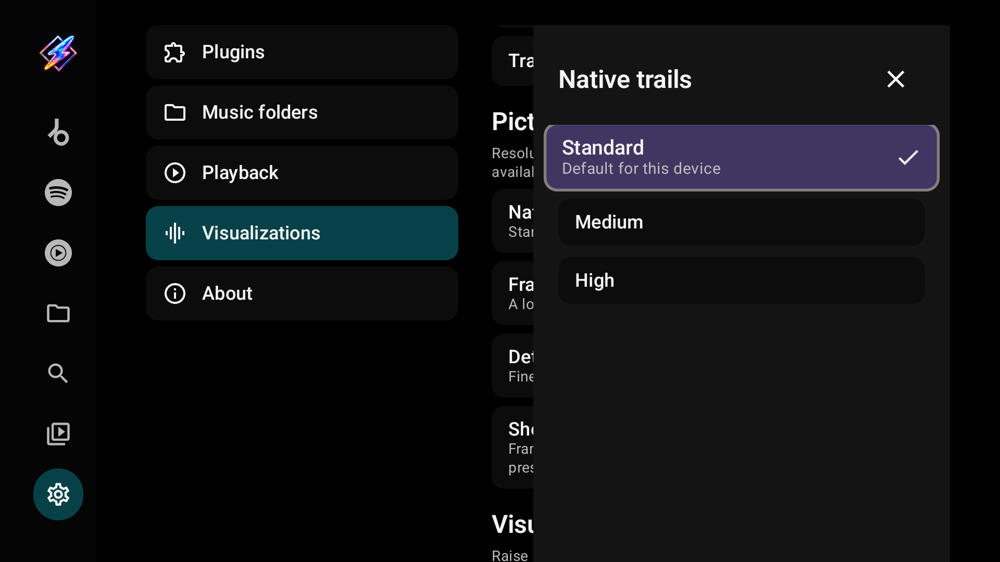
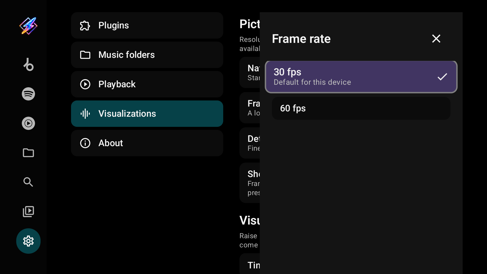

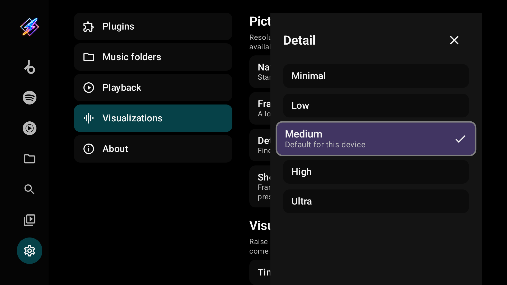
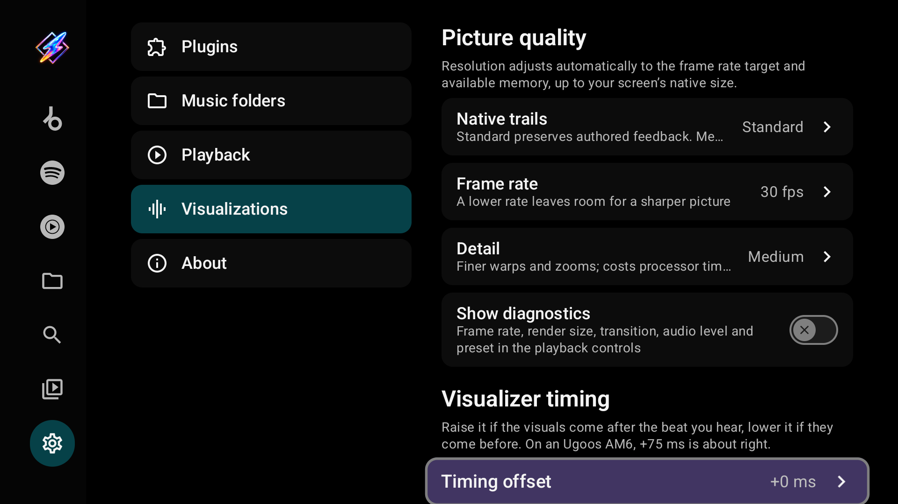

### Visualizer timing

**Timing offset** moves the visuals against the sound. The choices are −100, −50, −25, +0, +25, +50, +75, +100, +150 and +200 ms. Raise it if the visuals come after the beat you hear, lower it if they come before.

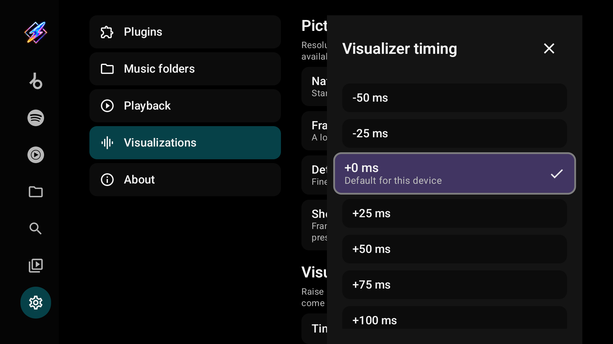

### Troubleshooting

For devices where the app closes when one preset changes into the next, as first reported on a Fire TV Stick 4K Max (2nd gen, PowerVR GE9215 GPU). Leave both switches **On** otherwise.

| Setting | What it does | Default |
| --- | --- | --- |
| **Background compile** | Compiles the next presets on a second thread with its own OpenGL context, so switches do not pause. *Off* compiles them at the switch, and the picture can hold for a second or two | On |
| **Shader binary cache** | Reuses compiled shader programs as driver binaries between the background and render threads. *Off* always compiles them from source | On |
| **Last exit** | The latest time Milkbeat crashed or ended while on screen, with how long ago, from Android's exit records (Android 11 and later). Select it for the exit report | — |

**Recent exits**, the exit report, starts with the device, its Android version, the GPU (once the visualizer has shown since Milkbeat started) and the switches as they are now. Then come up to five recent exits of Milkbeat, newest first. Each shows how long ago it was and why it ended, as Android recorded it: for example *crashed (native code)*, *killed by signal 11 (SIGSEGV)* or *killed for low memory*. It also shows whether Milkbeat was *on screen*, *playing in the background* or only *in the background*, Android's description and the memory in use when Android provides them. For a process that showed the visualizer, the report adds the switches it ran with and what the engine was last doing: the *render* line (loading, blending into or showing a preset) and the *prewarm* line (compiling a preset in the background, or idle), each with the seconds before the exit. Android 10 and older keep no exit records; the report then shows only the last engine activity.

The engine keeps those lines in a small file in Milkbeat's own storage. The file is excluded from backups and is never sent anywhere. Take a photo of the report when you report a crash. Steps are in [Troubleshooting](troubleshooting.md#the-app-closes-at-preset-changes).

Whether now playing shows the visualizer, the music video or the artwork is chosen in the player with its [view button](playback.md#visualizer-music-video-or-artwork), not here.

## About

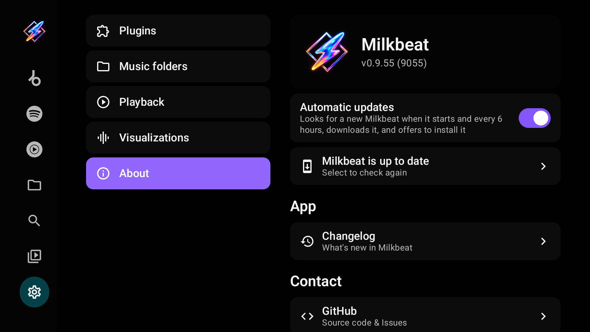

| Item | What it does |
| --- | --- |
| Version | The installed Milkbeat version and build number |
| **Automatic updates** | GitHub build only, on by default: looks for a new Milkbeat at start and every 6 hours, downloads it and offers to install it |
| Update status | *Milkbeat is up to date*, or the available update; select to check again |
| **Changelog** | What's new in Milkbeat |
| Contact and credits | GitHub source and issues, the creator, Flow, projectM and the licence |

The FOSS build has no updater. App updates and [plugin updates](providers.md#keep-plugins-up-to-date) are separate. Installing a signed release over the existing app keeps its data; uninstalling first does not.
