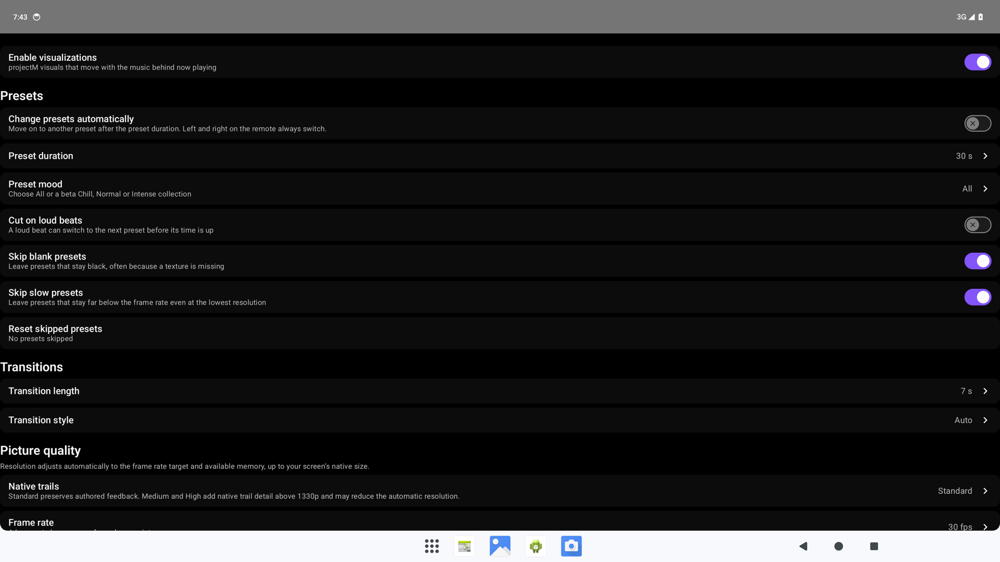
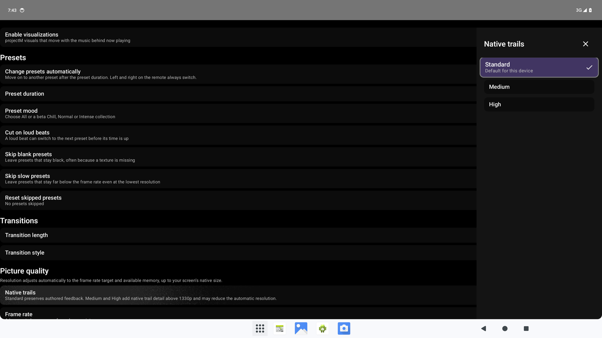

# Settings reference

[User guide](index.md)

Settings uses a category list on the left and its controls on the right. Change only the options relevant to your listening setup.

## Plugins

Install packages, select metadata/audio/video roles, set audio priority, manage provider sign-ins and play-history reporting, and index supported provider playlists. See [Providers](providers.md).

## Music folders

Choose local folders with Milkbeat's D-pad browser (storage access is requested only after **Choose local folder**), add SMB shares and WebDAV, SFTP or NFS servers, test access, and edit or remove sources. See [Folders](folders.md).

## Playback

| Setting | Purpose |
| --- | --- |
| Background Play | Allow playback to continue outside the app |
| Autoplay related videos | Play a suggested video when nothing is queued |
| Subtitles | Set the default subtitle preference |
| Skip silence | Skip supported silent sections |
| Stable Voice | Normalize supported audio for more consistent volume |
| Ambient mode | Use the existing video ambient background effect |

## Visualizations

The projectM settings from ProjectM TV, applied to Milkbeat's own visualizer. Anything you never change keeps the default ProjectM TV picks for your device; settings with several values open in a side panel that marks that default. Changes take effect the next time now playing shows the visualizer.

| Setting | Purpose |
| --- | --- |
| Enable visualizations | Enable projectM on supported devices |

Whether now playing shows the visualizer, the music video or the artwork is chosen in the player with its view button, not here. See [Playback and visuals](playback.md#visualizer-music-video-or-artwork).

### Presets

| Setting | Purpose | Default |
| --- | --- | --- |
| Change presets automatically | Move on to another preset after the preset duration. Left and Right on the remote always switch | On |
| Preset duration | How long a preset plays before the next one: 10 to 90 s | 30 s |
| Preset mood | All, or the core’s beta Chill, Normal and Intense collections. Previously saved retired music categories use All | All |
| Cut on loud beats | A loud beat can cut to the next preset before its time is up | Off |
| Skip blank presets | Leave presets that stay black, often because a texture is missing | On |
| Skip slow presets | Leave presets that stay far below the frame rate even at the lowest resolution | On |
| Reset skipped presets | Bring back every preset skipped as blank or slow | — |

The current core offers beta preset moods. The earlier music-category picker screenshot has been retired.

### Transitions

| Setting | Purpose | Default |
| --- | --- | --- |
| Transition length | How long one preset blends into the next, from instant to 10 s. Two presets render during a blend | 7 s (2 s on low-end devices) |
| Transition style | **Auto** blends at a lower resolution that adapts to keep the frame rate. **Lightweight** cuts while the old preset fades out on top, the cheapest. **Classic** is projectM's own blend at full resolution, the heaviest | Auto |

### Picture quality

Resolution is always **Auto**. It responds to the frame rate target and live memory headroom, up to your screen’s native size, including 4K. The core estimates rendering allocations and reserves memory for playback; Android can still reclaim processes under other system pressure. Previously saved fixed resolutions and memory-limit toggles now use automatic budgeting.

| Setting | Purpose | Default |
| --- | --- | --- |
| Native trails | **Standard** retains authored feedback; **Medium** and **High** add native trail detail above 1330p. Extra detail costs GPU work and can cause Auto to choose a lower resolution | Standard |
| Frame rate | Your display's refresh rate divided by 1, 2 or 4, at least 24 fps. A lower rate leaves room for a sharper picture | 30 fps |
| Detail | The per-vertex mesh, from Minimal to Ultra: finer warps and zooms at more processor time per frame | Medium (by device) |
| Show diagnostics | Show frame rate, render size, transition, audio level and preset in the playback controls | Off |

### Visualizer timing

**Timing offset** moves the visuals from −100 ms to +200 ms against the sound. Raise it if the visuals come after the beat you hear, lower it if they come before.

See [Playback and visuals](playback.md) for what these settings look like in now playing.

## Video playback without settings

Video tracks pick their own quality and codec automatically for your TV and the available streams, and SponsorBlock is always on for supported videos. Neither has a setting.

## About

View app/build information and update controls. The GitHub build provides automatic app updates and manual update checking. Update availability depends on the release service and device installer. The FOSS flavor does not include the app updater.

App updates and plugin updates are separate. Installing a signed release over the existing Milkbeat package preserves app data; uninstalling first does not.
