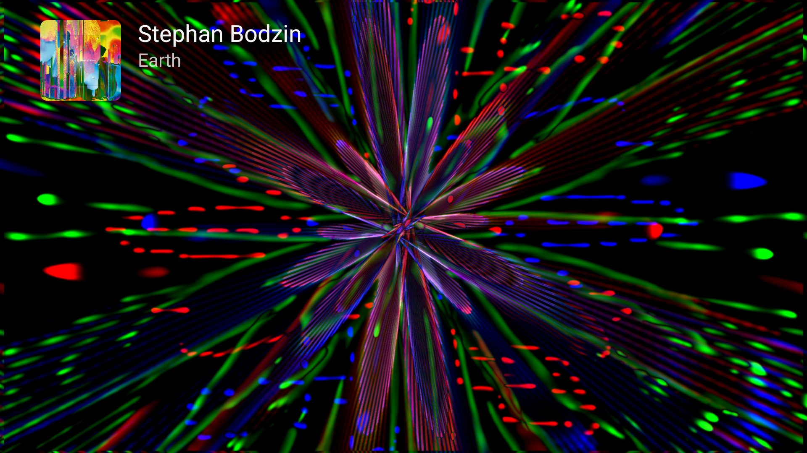

# The visualizer

Behind every track, Milkbeat can run **[ProjectM TV](https://johnneerdael.github.io/ProjectM-TV/)**: the MilkDrop visualizer for Android TV by the same author, built on [projectM](https://github.com/projectM-visualizer/projectm), the open-source reimplementation of Winamp's MilkDrop. It ships 9,606 presets from Jason Fletcher's *Cream of the Crop* collection and renders up to 4K on a 4K panel.

This page covers what the visualizer does inside Milkbeat. The **[ProjectM TV user guide](https://johnneerdael.github.io/ProjectM-TV/)** goes into depth on every setting, picture quality, preset moods and the engine itself; links below point to the relevant parts.

## How it fits into Milkbeat

- **It hears Milkbeat's own player.** The visuals take their sound straight from the track you are playing, not from the TV's output, so Milkbeat needs no microphone or audio-recording permission. Other apps' audio is not visualized.
- **It runs only when you can see it.** Rendering and audio monitoring stop when the visualizer leaves the screen, when you switch to the video or artwork view, and when Milkbeat goes to the background. A visible visualizer can keep drifting on silence while music is paused.
- **It uses the same engine as the standalone app.** Each Milkbeat release names the ProjectM TV core it ships in its [release notes](https://github.com/johnneerdael/Milkbeat/releases). Milkbeat uses ProjectM TV's defaults for your device until you change something.
- **Track details are Milkbeat's own.** The cover, artists and title in the upper left come from Milkbeat's player, so ProjectM TV's *Track display* and notification-access settings do not apply. Custom preset packs and ProjectM TV's own auto-update are not part of Milkbeat either.

## Control it with the remote

| Key | With the player controls hidden |
| --- | --- |
| ++arrow-left++ / ++arrow-right++ | Previous / another preset, as an instant cut |
| ++enter++ | Show the playback controls, including the view button and the audio level |

The audio level above the seek bar reads **Listening**, **Very quiet** or **No sound**. If it stays on *No sound* while music plays, see [Troubleshooting](troubleshooting.md#visuals-are-slow-black-or-do-not-react).

## Settings at a glance

All visualizer settings are in [Settings → Visualizations](settings.md#visualizations). Changes apply the next time now playing shows the visualizer. Settings with several values open in a side panel that marks the default for your device.

| Setting | In short | Default | In depth |
| --- | --- | --- | --- |
| Enable visualizations | Turns projectM on or off; off leaves video and artwork | On with about 2 GB of RAM or more, off on smaller devices | |
| Change presets automatically | Move on after the preset duration | On | [Main panel](https://johnneerdael.github.io/ProjectM-TV/settings/#main-panel) |
| Preset duration | 10 to 90 s per preset | 30 s | [Main panel](https://johnneerdael.github.io/ProjectM-TV/settings/#main-panel) |
| Preset mood | All, or the beta Chill, Normal and Intense collections | All | [Preset moods](https://johnneerdael.github.io/ProjectM-TV/predictive-collections/) |
| Cut on loud beats | A loud beat may cut to the next preset early | Off | [Advanced](https://johnneerdael.github.io/ProjectM-TV/settings/#advanced) |
| Skip blank / slow presets | Leave presets that stay black or far below the frame rate | On | [Advanced](https://johnneerdael.github.io/ProjectM-TV/settings/#advanced) |
| Transition length | How long one preset blends into the next | 7 s (2 s on low-RAM devices) | [Transitions](https://johnneerdael.github.io/ProjectM-TV/picture-quality/#transitions) |
| Transition style | Auto, Lightweight or Classic blends | Auto | [Transitions](https://johnneerdael.github.io/ProjectM-TV/picture-quality/#transitions) |
| Native trails | Standard, Medium or High feedback detail above 1330p | Standard | [Native trails](https://johnneerdael.github.io/ProjectM-TV/picture-quality/#native-trails) |
| Frame rate | The display rate divided by 1, 2 or 4, at least 24 fps | 30 fps | [Frame rate and detail](https://johnneerdael.github.io/ProjectM-TV/picture-quality/#frame-rate-and-detail) |
| Detail | Warp mesh from Minimal to Ultra | By device | [Frame rate and detail](https://johnneerdael.github.io/ProjectM-TV/picture-quality/#frame-rate-and-detail) |
| Show diagnostics | A status line in the player controls | Off | [Diagnostics](https://johnneerdael.github.io/ProjectM-TV/settings/#diagnostics) |
| Timing offset | Moves the visuals against the sound: −100, −50, −25, +0, +25, +50, +75, +100, +150 or +200 ms | +0 ms | |

**Resolution is always automatic in Milkbeat.** It follows the frame-rate target and live memory headroom, up to your screen's native size. Raising the frame rate or adding trail detail can make Auto choose a lower resolution. [How Auto resolution works](https://johnneerdael.github.io/ProjectM-TV/picture-quality/#resolution).

## Preset moods (beta)

**All** shuffles the whole library. **Chill**, **Normal** and **Intense** are overlapping beta collections chosen from a measured activity score for each preset; they are predictions and will improve, and Chill is not a guarantee of no flashing. Skipped presets still stay out of every mood. [What the moods look like and how they are made](https://johnneerdael.github.io/ProjectM-TV/predictive-collections/).

## Timing

Raise **Timing offset** if the visuals come after the beat you hear, lower it if they come before. Audio paths differ per TV and receiver, so judge by watching and listening; on an Ugoos AM6, +75 ms is about right.

## Diagnostics

With **Show diagnostics** on, the player controls show the measured and target frame rate, the render size and whether it is automatic, the transition state, the audio level and the preset name. Use it when investigating slow visuals: a still screenshot says nothing about frame rate.

## What the main options look like

With **Transition style** on Lightweight, presets cut and the old one fades out on top; diagnostics read `lightweight` instead of `blend`. With **Change presets automatically** off, a preset stays until you press Left or Right. With **Cut on loud beats** on, a loud beat can cut to the next preset before its time is up.

## When the visuals misbehave

Most visual problems are the same as in the standalone app. ProjectM TV's troubleshooting covers [stutter](https://johnneerdael.github.io/ProjectM-TV/troubleshooting/#the-picture-stutters), [a render size below the TV's](https://johnneerdael.github.io/ProjectM-TV/troubleshooting/#the-render-size-is-lower-than-my-tv), [black, frozen or skipped presets](https://johnneerdael.github.io/ProjectM-TV/troubleshooting/#a-preset-is-black-frozen-or-skipped) and [presets that look different from MilkDrop](https://johnneerdael.github.io/ProjectM-TV/troubleshooting/#a-preset-looks-different-from-milkdrop-or-another-player). Milkbeat-specific checks are in [Troubleshooting](troubleshooting.md#visuals-are-slow-black-or-do-not-react).

The engine needs OpenGL ES 3.0; on a device without it, Settings → Visualizations reports that it can't run the visualizer. At least 2 GB of RAM is recommended.
